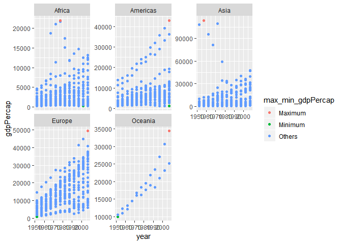
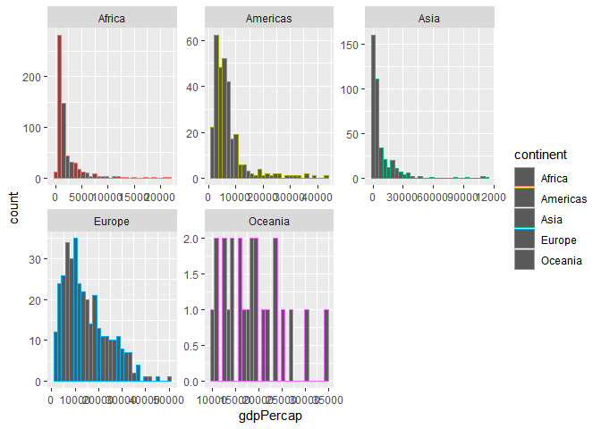
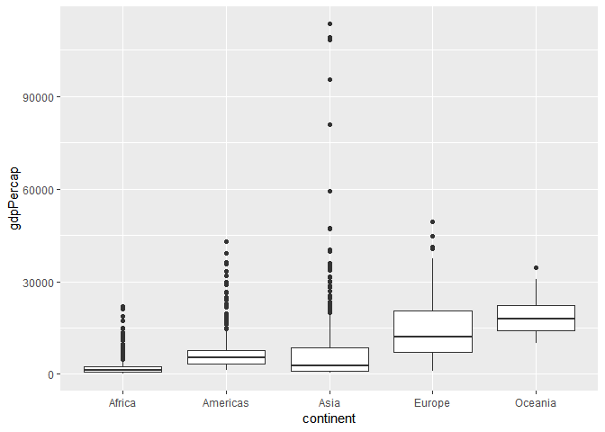
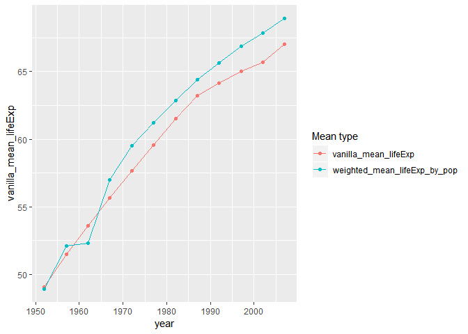

STAT 545A Homework 3
================
Junbin ZHANG
Sept 25, 2018

# Bring rectangular data in

``` r
## load gapminder
library(gapminder)
## load tidyverse
library(tidyverse)
```

    ## -- Attaching packages ----------------------------------------------------------------------------------- tidyverse 1.2.1 --

    ## v ggplot2 3.0.0     v purrr   0.2.5
    ## v tibble  1.4.2     v dplyr   0.7.6
    ## v tidyr   0.8.1     v stringr 1.3.1
    ## v readr   1.1.1     v forcats 0.3.0

    ## -- Conflicts -------------------------------------------------------------------------------------- tidyverse_conflicts() --
    ## x dplyr::filter() masks stats::filter()
    ## x dplyr::lag()    masks stats::lag()

# Tasks

## Get the maximum and minimum of GDP per capita for all continents.

We first create a table to show the maximum and minimum of GDP per
capita for all continents.

``` r
# get data of maximum and minimum of GDP per capita for all continents
data <- gapminder %>% 
  # group by continent
  group_by(continent) %>% 
  # calculate summaries
  summarize(
    max_gdpPercap = max(gdpPercap),
    min_gdpPercap = min(gdpPercap),
  )
# get corresponding rows for the maximum data
max_country <- gapminder %>% 
  # filter data with maximum GDP per capita
  filter(gdpPercap %in% data$max_gdpPercap) %>% 
  # create column with country and year
  mutate(
    max_country_year = paste(country, year, sep=",")
  ) %>% 
  # make sure the order is the same as "data"
  arrange(continent) %>% 
  # select only mutated column
  select(max_country_year)

# get corresponding rows for the minimum data
min_country <- gapminder %>% 
  # filter data with minimum GDP per capita
  filter(gdpPercap %in% data$min_gdpPercap) %>% 
  # create column with country and year
  mutate(
    min_country_year = paste(country, year, sep=",")
  ) %>% 
  # make sure the order is the same as "data"
  arrange(continent) %>% 
  # select only mutated column
  select(min_country_year)

# display table with combined data
data.frame(continent=data$continent, max_gdpPercap=data$max_gdpPercap, max_country, min_gdpPercap=data$min_gdpPercap, min_country) %>% 
  knitr::kable()
```

| continent | max\_gdpPercap | max\_country\_year | min\_gdpPercap | min\_country\_year          |
| :-------- | -------------: | :----------------- | -------------: | :-------------------------- |
| Africa    |       21951.21 | Libya,1977         |       241.1659 | Congo, Dem. Rep.,2002       |
| Americas  |       42951.65 | United States,2007 |      1201.6372 | Haiti,2007                  |
| Asia      |      113523.13 | Kuwait,1957        |       331.0000 | Myanmar,1952                |
| Europe    |       49357.19 | Norway,2007        |       973.5332 | Bosnia and Herzegovina,1952 |
| Oceania   |       34435.37 | Australia,2007     |     10039.5956 | Australia,1952              |

Let’s show them on a scatterplot.

``` r
gapminder %>%
  # create a new column to indicate whether a data point is maximum or minimum gdpPercap
  mutate(
    max_min_gdpPercap=ifelse(
      gdpPercap %in% data$max_gdpPercap,
      "Maximum",
      ifelse(
        gdpPercap %in% data$min_gdpPercap,
        "Minimum",
        "Others"
        )
      )
  ) %>% 
  # year as x axis and gdpPercap as y axis, use max_min_gdpPercap as color
  ggplot(aes(year, gdpPercap, color=max_min_gdpPercap), alpha=0.1) +
  # make it a scatterplot
  geom_point() +
  # facetting using continent
  facet_wrap(~continent, scales="free_y")
```

<!-- -->

From the table and figure, we notice the maximum and minimum values of
gdpPercap are different in different continents. They also appear in
different countries and years. The scatterplot provides a better view,
except we cannot get which countries has the maximum/minimum gdpPercap.

## Look at the spread of GDP per capita within the continents.

Let’s show a table with the range, mean and deviation of GDP per capita
within the continents.

``` r
gapminder %>%
  # group by continent
  group_by(continent) %>%
  # calculate summaries
  summarize(
    # calculate minimum
    min_gdpPercap=min(gdpPercap),
    # calculate maximum
    max_gdpPercap=min(gdpPercap),
    # calculate mean
    mean_gdpPercap=mean(gdpPercap),
    # calculate standard deviation
    sd_gdpPercap=sd(gdpPercap)
  ) %>% 
  # display the table
  knitr::kable()
```

| continent | min\_gdpPercap | max\_gdpPercap | mean\_gdpPercap | sd\_gdpPercap |
| :-------- | -------------: | -------------: | --------------: | ------------: |
| Africa    |       241.1659 |       241.1659 |        2193.755 |      2827.930 |
| Americas  |      1201.6372 |      1201.6372 |        7136.110 |      6396.764 |
| Asia      |       331.0000 |       331.0000 |        7902.150 |     14045.373 |
| Europe    |       973.5332 |       973.5332 |       14469.476 |      9355.213 |
| Oceania   |     10039.5956 |     10039.5956 |       18621.609 |      6358.983 |

We can use histogram and boxplot to do the same task. Notice that in
histogram, `scales="free"` is needed to scale both x and y axes, so the
figure should be clearer.

``` r
gapminder %>% 
  # gdpPercap as x axis
  ggplot(aes(gdpPercap, color=continent)) +
  # facetting by continent
  facet_wrap(~continent, scales="free") +
  # make it a histogram
  geom_histogram(bins=30)
```

<!-- -->

``` r
gapminder %>% 
  # continent as x axis, gdpPercap as y axis
  ggplot(aes(x=continent, y=gdpPercap)) +
  # make it a boxplot
  geom_boxplot()
```

<!-- -->

A table provides accurate numbers on the spread of GDP per capita, but
it cannot show the details inside the data. While histogram and boxplot
provide better summaries (e.g. the boxplot contains outliers). Comparing
histogram and boxplot, histogram only counts data within the same bins,
while boxplot also shows some statistics facts (like quartiles) of
data.

## Compute a trimmed mean of life expectancy for different years. Or a weighted mean, weighting by population. Just try something other than the plain vanilla mean.

Let’s calculate the weighted mean of life expectancy, weighting by
population.

``` r
means <- gapminder %>% 
  # group by year
  group_by(year) %>% 
  # calculate vanilla mean and weighted mean
  summarize(
    vanilla_mean_lifeExp = mean(lifeExp),
    weighted_mean_lifeExp_by_pop = weighted.mean(lifeExp, pop)
  )

# display as table
means %>% 
  knitr::kable()
```

| year | vanilla\_mean\_lifeExp | weighted\_mean\_lifeExp\_by\_pop |
| ---: | ---------------------: | -------------------------------: |
| 1952 |               49.05762 |                         48.94424 |
| 1957 |               51.50740 |                         52.12189 |
| 1962 |               53.60925 |                         52.32438 |
| 1967 |               55.67829 |                         56.98431 |
| 1972 |               57.64739 |                         59.51478 |
| 1977 |               59.57016 |                         61.23726 |
| 1982 |               61.53320 |                         62.88176 |
| 1987 |               63.21261 |                         64.41635 |
| 1992 |               64.16034 |                         65.64590 |
| 1997 |               65.01468 |                         66.84934 |
| 2002 |               65.69492 |                         67.83904 |
| 2007 |               67.00742 |                         68.91909 |

Let’s draw some line plots to show them.

``` r
means %>% 
  ggplot() +
  geom_line(aes(x=year, y=vanilla_mean_lifeExp, color="vanilla_mean_lifeExp")) +
  geom_point(aes(x=year, y=vanilla_mean_lifeExp, color="vanilla_mean_lifeExp")) +
  geom_line(aes(x=year, y=weighted_mean_lifeExp_by_pop, color="weighted_mean_lifeExp_by_pop")) +
  geom_point(aes(x=year, y=weighted_mean_lifeExp_by_pop, color="weighted_mean_lifeExp_by_pop")) +
  scale_color_discrete("Mean type")
```

<!-- -->

## How is life expectancy changing over time on different continents?

## Report the absolute and/or relative abundance of countries with low life expectancy over time by continent: Compute some measure of worldwide life expectancy - you decide - a mean or median or some other quantile or perhaps your current age. Then determine how many countries on each continent have a life expectancy less than this benchmark, for each year.

## Find countries with interesting stories. Open-ended and, therefore, hard. Promising but unsuccessful attempts are encouraged. This will generate interesting questions to follow up on in class.

# But I want to do more\!

# Notes

# References
