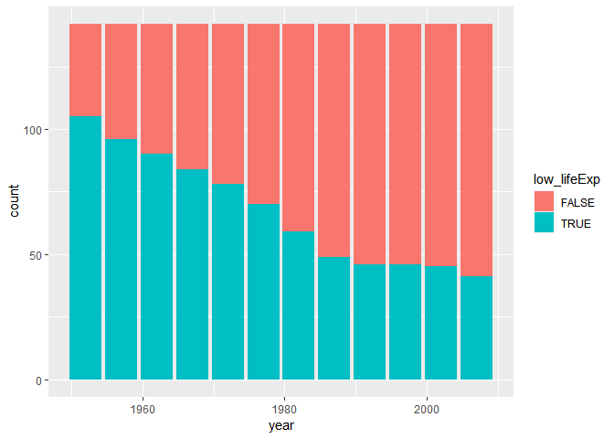
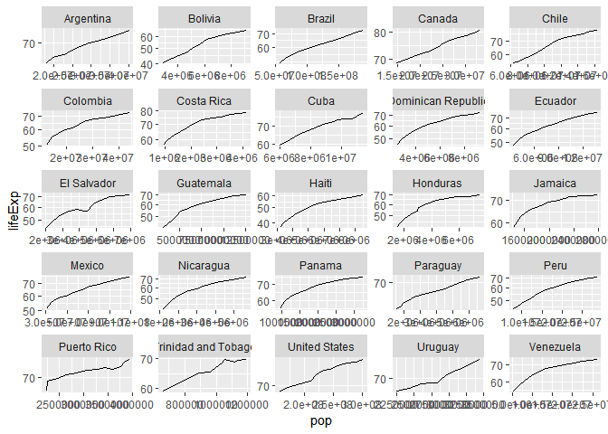

# Bring rectangular data in

```r
## load gapminder
library(gapminder)
## load tidyverse
library(tidyverse)
```

```
## -- Attaching packages -------------------------------------------------------------------- tidyverse 1.2.1 --
```

```
## v ggplot2 3.0.0     v purrr   0.2.5
## v tibble  1.4.2     v dplyr   0.7.6
## v tidyr   0.8.1     v stringr 1.3.1
## v readr   1.1.1     v forcats 0.3.0
```

```
## -- Conflicts ----------------------------------------------------------------------- tidyverse_conflicts() --
## x dplyr::filter() masks stats::filter()
## x dplyr::lag()    masks stats::lag()
```

# Tasks

## Get the maximum and minimum of GDP per capita for all continents.

We first create a table to show the maximum and minimum of GDP per capita for all continents.


```r
# get data of maximum and minimum of GDP per capita for all continents
data <- gapminder %>% 
  # group by continent
  group_by(continent) %>% 
  # calculate summaries
  summarize(
    max_gdpPercap = max(gdpPercap),
    min_gdpPercap = min(gdpPercap),
  )
# get corresponding rows for the maximum data
max_country <- gapminder %>% 
  # filter data with maximum GDP per capita
  filter(gdpPercap %in% data$max_gdpPercap) %>% 
  # create column with country and year
  mutate(
    max_country_year = paste(country, year, sep=",")
  ) %>% 
  # make sure the order is the same as "data"
  arrange(continent) %>% 
  # select only mutated column
  select(max_country_year)

# get corresponding rows for the minimum data
min_country <- gapminder %>% 
  # filter data with minimum GDP per capita
  filter(gdpPercap %in% data$min_gdpPercap) %>% 
  # create column with country and year
  mutate(
    min_country_year = paste(country, year, sep=",")
  ) %>% 
  # make sure the order is the same as "data"
  arrange(continent) %>% 
  # select only mutated column
  select(min_country_year)

# display table with combined data
data.frame(continent=data$continent, max_gdpPercap=data$max_gdpPercap, max_country, min_gdpPercap=data$min_gdpPercap, min_country) %>% 
  knitr::kable()
```


continent    max_gdpPercap  max_country_year      min_gdpPercap  min_country_year            
----------  --------------  -------------------  --------------  ----------------------------
Africa            21951.21  Libya,1977                 241.1659  Congo, Dem. Rep.,2002       
Americas          42951.65  United States,2007        1201.6372  Haiti,2007                  
Asia             113523.13  Kuwait,1957                331.0000  Myanmar,1952                
Europe            49357.19  Norway,2007                973.5332  Bosnia and Herzegovina,1952 
Oceania           34435.37  Australia,2007           10039.5956  Australia,1952              

Let's show them on a scatterplot.


```r
gapminder %>%
  # create a new column to indicate whether a data point is maximum or minimum gdpPercap
  mutate(
    max_min_gdpPercap=ifelse(
      gdpPercap %in% data$max_gdpPercap,
      "Maximum",
      ifelse(
        gdpPercap %in% data$min_gdpPercap,
        "Minimum",
        "Others"
        )
      )
  ) %>% 
  # year as x axis and gdpPercap as y axis, use max_min_gdpPercap as color
  ggplot(aes(year, gdpPercap, color=max_min_gdpPercap), alpha=0.1) +
  # make it a scatterplot
  geom_point() +
  # facetting using continent
  facet_wrap(~continent, scales="free_y")
```

<!-- -->

From the table and figure, we notice the maximum and minimum values of gdpPercap are different in different continents. They also appear in different countries and years. The scatterplot provides a better view, except we cannot get which countries has the maximum/minimum gdpPercap.

## Look at the spread of GDP per capita within the continents.

Let's show a table with the range, mean and deviation of GDP per capita within the continents.


```r
gapminder %>%
  # group by continent
  group_by(continent) %>%
  # calculate summaries
  summarize(
    # calculate minimum
    min_gdpPercap=min(gdpPercap),
    # calculate maximum
    max_gdpPercap=min(gdpPercap),
    # calculate mean
    mean_gdpPercap=mean(gdpPercap),
    # calculate standard deviation
    sd_gdpPercap=sd(gdpPercap)
  ) %>% 
  # display the table
  knitr::kable()
```


continent    min_gdpPercap   max_gdpPercap   mean_gdpPercap   sd_gdpPercap
----------  --------------  --------------  ---------------  -------------
Africa            241.1659        241.1659         2193.755       2827.930
Americas         1201.6372       1201.6372         7136.110       6396.764
Asia              331.0000        331.0000         7902.150      14045.373
Europe            973.5332        973.5332        14469.476       9355.213
Oceania         10039.5956      10039.5956        18621.609       6358.983


We can use histogram and boxplot to do the same task. Notice that in histogram, `scales="free"` is needed to scale both x and y axes, so the figure should be clearer. 


```r
gapminder %>% 
  # gdpPercap as x axis
  ggplot(aes(gdpPercap, color=continent)) +
  # facetting by continent
  facet_wrap(~continent, scales="free") +
  # make it a histogram
  geom_histogram(bins=30)
```

<!-- -->


```r
gapminder %>% 
  # continent as x axis, gdpPercap as y axis
  ggplot(aes(x=continent, y=gdpPercap)) +
  # make it a boxplot
  geom_boxplot()
```

<!-- -->

A table provides accurate numbers on the spread of GDP per capita, but it cannot show the details inside the data. While histogram and boxplot provide better summaries (e.g. the boxplot contains outliers). Comparing histogram and boxplot, histogram only counts data within the same bins, while boxplot also shows some statistics facts (like quartiles) of data.

## Compute a trimmed mean of life expectancy for different years. Or a weighted mean, weighting by population. Just try something other than the plain vanilla mean.

Let's calculate the weighted mean of life expectancy, weighting by population.


```r
means <- gapminder %>% 
  # group by year
  group_by(year) %>% 
  # calculate vanilla mean and weighted mean
  summarize(
    vanilla_mean_lifeExp = mean(lifeExp),
    weighted_mean_lifeExp_by_pop = weighted.mean(lifeExp, pop)
  )

# display as table
means %>% 
  knitr::kable()
```


 year   vanilla_mean_lifeExp   weighted_mean_lifeExp_by_pop
-----  ---------------------  -----------------------------
 1952               49.05762                       48.94424
 1957               51.50740                       52.12189
 1962               53.60925                       52.32438
 1967               55.67829                       56.98431
 1972               57.64739                       59.51478
 1977               59.57016                       61.23726
 1982               61.53320                       62.88176
 1987               63.21261                       64.41635
 1992               64.16034                       65.64590
 1997               65.01468                       66.84934
 2002               65.69492                       67.83904
 2007               67.00742                       68.91909

Let's draw some line plots to show them.


```r
means %>% 
  ggplot() +
  # make a line plot with points for vanilla_mean_lifeExp
  geom_line(aes(x=year, y=vanilla_mean_lifeExp, color="vanilla_mean_lifeExp")) +
  geom_point(aes(x=year, y=vanilla_mean_lifeExp, color="vanilla_mean_lifeExp")) +
  # make a line plot with points for weighted_mean_lifeExp_by_pop
  geom_line(aes(x=year, y=weighted_mean_lifeExp_by_pop, color="weighted_mean_lifeExp_by_pop")) +
  geom_point(aes(x=year, y=weighted_mean_lifeExp_by_pop, color="weighted_mean_lifeExp_by_pop")) +
  # add legend for two lines
  scale_color_discrete("Mean type")
```

<!-- -->

Basically, the life expectancy tends to increase thoughout the years.

## How is life expectancy changing over time on different continents?

Let's first use a table to show the trend of how life expectancy changes. We also calculate the changes in every five years.


```r
changes <- gapminder %>% 
  # need to group by continent and year
  group_by(continent, year) %>% 
  # use mean as benchmark
  summarize(
    mean_lifeExp = mean(lifeExp)
  ) %>% 
  # calculate absolute change and relative change
  mutate(
    change_in_five_years = mean_lifeExp - lag(mean_lifeExp)
  )

# display the table
changes %>% 
  knitr::kable()
```


continent    year   mean_lifeExp   change_in_five_years
----------  -----  -------------  ---------------------
Africa       1952       39.13550                     NA
Africa       1957       41.26635              2.1308462
Africa       1962       43.31944              2.0530962
Africa       1967       45.33454              2.0150962
Africa       1972       47.45094              2.1164038
Africa       1977       49.58042              2.1294808
Africa       1982       51.59287              2.0124423
Africa       1987       53.34479              1.7519231
Africa       1992       53.62958              0.2847885
Africa       1997       53.59827             -0.0313077
Africa       2002       53.32523             -0.2730385
Africa       2007       54.80604              1.4808077
Americas     1952       53.27984                     NA
Americas     1957       55.96028              2.6804400
Americas     1962       58.39876              2.4384800
Americas     1967       60.41092              2.0121600
Americas     1972       62.39492              1.9840000
Americas     1977       64.39156              1.9966400
Americas     1982       66.22884              1.8372800
Americas     1987       68.09072              1.8618800
Americas     1992       69.56836              1.4776400
Americas     1997       71.15048              1.5821200
Americas     2002       72.42204              1.2715600
Americas     2007       73.60812              1.1860800
Asia         1952       46.31439                     NA
Asia         1957       49.31854              3.0041503
Asia         1962       51.56322              2.2446788
Asia         1967       54.66364              3.1004170
Asia         1972       57.31927              2.6556291
Asia         1977       59.61056              2.2912873
Asia         1982       62.61794              3.0073830
Asia         1987       64.85118              2.2332424
Asia         1992       66.53721              1.6860303
Asia         1997       68.02052              1.4833030
Asia         2002       69.23388              1.2133636
Asia         2007       70.72848              1.4946061
Europe       1952       64.40850                     NA
Europe       1957       66.70307              2.2945667
Europe       1962       68.53923              1.8361667
Europe       1967       69.73760              1.1983667
Europe       1972       70.77503              1.0374333
Europe       1977       71.93777              1.1627333
Europe       1982       72.80640              0.8686333
Europe       1987       73.64217              0.8357667
Europe       1992       74.44010              0.7979333
Europe       1997       75.50517              1.0650667
Europe       2002       76.70060              1.1954333
Europe       2007       77.64860              0.9480000
Oceania      1952       69.25500                     NA
Oceania      1957       70.29500              1.0400000
Oceania      1962       71.08500              0.7900000
Oceania      1967       71.31000              0.2250000
Oceania      1972       71.91000              0.6000000
Oceania      1977       72.85500              0.9450000
Oceania      1982       74.29000              1.4350000
Oceania      1987       75.32000              1.0300000
Oceania      1992       76.94500              1.6250000
Oceania      1997       78.19000              1.2450000
Oceania      2002       79.74000              1.5500000
Oceania      2007       80.71950              0.9795000

Let's plot it out.


```r
changes %>% 
  # year as x axis and mean_lifeExp as y axis
  ggplot(aes(year, mean_lifeExp)) +
  # facetting by continent
  facet_wrap(~continent, scales="free_y")+
  # make a line plot with points
  geom_line() +
  geom_point()
```

<!-- -->


```r
changes %>%
  # remove NA values
  filter(change_in_five_years != "NA") %>% 
  # year as x axis and change_in_five_years as y axis
  ggplot(aes(year, change_in_five_years)) +
  # facetting by continent
  facet_wrap(~continent, scales="free_y")+
  # make a line plot with points
  geom_line() +
  geom_point()
```

<!-- -->

From the above two figures, we get to know:
- Except Africa suffered from a decrement between 1997 and 2002, all the continents have increment throughout the years.
- Generally speaking, except Oceania, the speeds of lifeExp grows of other continents become smaller and smaller.

## Report the absolute and/or relative abundance of countries with low life expectancy over time by continent: Compute some measure of worldwide life expectancy - you decide - a mean or median or some other quantile or perhaps your current age. Then determine how many countries on each continent have a life expectancy less than this benchmark, for each year.

Let's first know the range and mean of worldwide life expectancy, so we can decide a benchmark.


```r
range(gapminder$lifeExp)
```

```
## [1] 23.599 82.603
```


```r
mean(gapminder$lifeExp)
```

```
## [1] 59.47444
```

The mean is somehow near the middle of the range, so we can use it as a benchmark.

Let's first check if the lifeExp of a country in a certain year is higher/lower than the average.


```r
lifeExpCheck <- gapminder %>% 
  # group by country and year
  group_by(country, year) %>% 
  # check if a country has low lifeExp
  mutate(
    low_lifeExp = lifeExp < mean(gapminder$lifeExp)
  ) %>% 
  # select only necessary columns
  select(country, year, lifeExp, low_lifeExp)

# display the table
lifeExpCheck %>% 
  knitr::kable()
```


country                     year    lifeExp  low_lifeExp 
-------------------------  -----  ---------  ------------
Afghanistan                 1952   28.80100  TRUE        
Afghanistan                 1957   30.33200  TRUE        
Afghanistan                 1962   31.99700  TRUE        
Afghanistan                 1967   34.02000  TRUE        
Afghanistan                 1972   36.08800  TRUE        
Afghanistan                 1977   38.43800  TRUE        
Afghanistan                 1982   39.85400  TRUE        
Afghanistan                 1987   40.82200  TRUE        
Afghanistan                 1992   41.67400  TRUE        
Afghanistan                 1997   41.76300  TRUE        
Afghanistan                 2002   42.12900  TRUE        
Afghanistan                 2007   43.82800  TRUE        
Albania                     1952   55.23000  TRUE        
Albania                     1957   59.28000  TRUE        
Albania                     1962   64.82000  FALSE       
Albania                     1967   66.22000  FALSE       
Albania                     1972   67.69000  FALSE       
Albania                     1977   68.93000  FALSE       
Albania                     1982   70.42000  FALSE       
Albania                     1987   72.00000  FALSE       
Albania                     1992   71.58100  FALSE       
Albania                     1997   72.95000  FALSE       
Albania                     2002   75.65100  FALSE       
Albania                     2007   76.42300  FALSE       
Algeria                     1952   43.07700  TRUE        
Algeria                     1957   45.68500  TRUE        
Algeria                     1962   48.30300  TRUE        
Algeria                     1967   51.40700  TRUE        
Algeria                     1972   54.51800  TRUE        
Algeria                     1977   58.01400  TRUE        
Algeria                     1982   61.36800  FALSE       
Algeria                     1987   65.79900  FALSE       
Algeria                     1992   67.74400  FALSE       
Algeria                     1997   69.15200  FALSE       
Algeria                     2002   70.99400  FALSE       
Algeria                     2007   72.30100  FALSE       
Angola                      1952   30.01500  TRUE        
Angola                      1957   31.99900  TRUE        
Angola                      1962   34.00000  TRUE        
Angola                      1967   35.98500  TRUE        
Angola                      1972   37.92800  TRUE        
Angola                      1977   39.48300  TRUE        
Angola                      1982   39.94200  TRUE        
Angola                      1987   39.90600  TRUE        
Angola                      1992   40.64700  TRUE        
Angola                      1997   40.96300  TRUE        
Angola                      2002   41.00300  TRUE        
Angola                      2007   42.73100  TRUE        
Argentina                   1952   62.48500  FALSE       
Argentina                   1957   64.39900  FALSE       
Argentina                   1962   65.14200  FALSE       
Argentina                   1967   65.63400  FALSE       
Argentina                   1972   67.06500  FALSE       
Argentina                   1977   68.48100  FALSE       
Argentina                   1982   69.94200  FALSE       
Argentina                   1987   70.77400  FALSE       
Argentina                   1992   71.86800  FALSE       
Argentina                   1997   73.27500  FALSE       
Argentina                   2002   74.34000  FALSE       
Argentina                   2007   75.32000  FALSE       
Australia                   1952   69.12000  FALSE       
Australia                   1957   70.33000  FALSE       
Australia                   1962   70.93000  FALSE       
Australia                   1967   71.10000  FALSE       
Australia                   1972   71.93000  FALSE       
Australia                   1977   73.49000  FALSE       
Australia                   1982   74.74000  FALSE       
Australia                   1987   76.32000  FALSE       
Australia                   1992   77.56000  FALSE       
Australia                   1997   78.83000  FALSE       
Australia                   2002   80.37000  FALSE       
Australia                   2007   81.23500  FALSE       
Austria                     1952   66.80000  FALSE       
Austria                     1957   67.48000  FALSE       
Austria                     1962   69.54000  FALSE       
Austria                     1967   70.14000  FALSE       
Austria                     1972   70.63000  FALSE       
Austria                     1977   72.17000  FALSE       
Austria                     1982   73.18000  FALSE       
Austria                     1987   74.94000  FALSE       
Austria                     1992   76.04000  FALSE       
Austria                     1997   77.51000  FALSE       
Austria                     2002   78.98000  FALSE       
Austria                     2007   79.82900  FALSE       
Bahrain                     1952   50.93900  TRUE        
Bahrain                     1957   53.83200  TRUE        
Bahrain                     1962   56.92300  TRUE        
Bahrain                     1967   59.92300  FALSE       
Bahrain                     1972   63.30000  FALSE       
Bahrain                     1977   65.59300  FALSE       
Bahrain                     1982   69.05200  FALSE       
Bahrain                     1987   70.75000  FALSE       
Bahrain                     1992   72.60100  FALSE       
Bahrain                     1997   73.92500  FALSE       
Bahrain                     2002   74.79500  FALSE       
Bahrain                     2007   75.63500  FALSE       
Bangladesh                  1952   37.48400  TRUE        
Bangladesh                  1957   39.34800  TRUE        
Bangladesh                  1962   41.21600  TRUE        
Bangladesh                  1967   43.45300  TRUE        
Bangladesh                  1972   45.25200  TRUE        
Bangladesh                  1977   46.92300  TRUE        
Bangladesh                  1982   50.00900  TRUE        
Bangladesh                  1987   52.81900  TRUE        
Bangladesh                  1992   56.01800  TRUE        
Bangladesh                  1997   59.41200  TRUE        
Bangladesh                  2002   62.01300  FALSE       
Bangladesh                  2007   64.06200  FALSE       
Belgium                     1952   68.00000  FALSE       
Belgium                     1957   69.24000  FALSE       
Belgium                     1962   70.25000  FALSE       
Belgium                     1967   70.94000  FALSE       
Belgium                     1972   71.44000  FALSE       
Belgium                     1977   72.80000  FALSE       
Belgium                     1982   73.93000  FALSE       
Belgium                     1987   75.35000  FALSE       
Belgium                     1992   76.46000  FALSE       
Belgium                     1997   77.53000  FALSE       
Belgium                     2002   78.32000  FALSE       
Belgium                     2007   79.44100  FALSE       
Benin                       1952   38.22300  TRUE        
Benin                       1957   40.35800  TRUE        
Benin                       1962   42.61800  TRUE        
Benin                       1967   44.88500  TRUE        
Benin                       1972   47.01400  TRUE        
Benin                       1977   49.19000  TRUE        
Benin                       1982   50.90400  TRUE        
Benin                       1987   52.33700  TRUE        
Benin                       1992   53.91900  TRUE        
Benin                       1997   54.77700  TRUE        
Benin                       2002   54.40600  TRUE        
Benin                       2007   56.72800  TRUE        
Bolivia                     1952   40.41400  TRUE        
Bolivia                     1957   41.89000  TRUE        
Bolivia                     1962   43.42800  TRUE        
Bolivia                     1967   45.03200  TRUE        
Bolivia                     1972   46.71400  TRUE        
Bolivia                     1977   50.02300  TRUE        
Bolivia                     1982   53.85900  TRUE        
Bolivia                     1987   57.25100  TRUE        
Bolivia                     1992   59.95700  FALSE       
Bolivia                     1997   62.05000  FALSE       
Bolivia                     2002   63.88300  FALSE       
Bolivia                     2007   65.55400  FALSE       
Bosnia and Herzegovina      1952   53.82000  TRUE        
Bosnia and Herzegovina      1957   58.45000  TRUE        
Bosnia and Herzegovina      1962   61.93000  FALSE       
Bosnia and Herzegovina      1967   64.79000  FALSE       
Bosnia and Herzegovina      1972   67.45000  FALSE       
Bosnia and Herzegovina      1977   69.86000  FALSE       
Bosnia and Herzegovina      1982   70.69000  FALSE       
Bosnia and Herzegovina      1987   71.14000  FALSE       
Bosnia and Herzegovina      1992   72.17800  FALSE       
Bosnia and Herzegovina      1997   73.24400  FALSE       
Bosnia and Herzegovina      2002   74.09000  FALSE       
Bosnia and Herzegovina      2007   74.85200  FALSE       
Botswana                    1952   47.62200  TRUE        
Botswana                    1957   49.61800  TRUE        
Botswana                    1962   51.52000  TRUE        
Botswana                    1967   53.29800  TRUE        
Botswana                    1972   56.02400  TRUE        
Botswana                    1977   59.31900  TRUE        
Botswana                    1982   61.48400  FALSE       
Botswana                    1987   63.62200  FALSE       
Botswana                    1992   62.74500  FALSE       
Botswana                    1997   52.55600  TRUE        
Botswana                    2002   46.63400  TRUE        
Botswana                    2007   50.72800  TRUE        
Brazil                      1952   50.91700  TRUE        
Brazil                      1957   53.28500  TRUE        
Brazil                      1962   55.66500  TRUE        
Brazil                      1967   57.63200  TRUE        
Brazil                      1972   59.50400  FALSE       
Brazil                      1977   61.48900  FALSE       
Brazil                      1982   63.33600  FALSE       
Brazil                      1987   65.20500  FALSE       
Brazil                      1992   67.05700  FALSE       
Brazil                      1997   69.38800  FALSE       
Brazil                      2002   71.00600  FALSE       
Brazil                      2007   72.39000  FALSE       
Bulgaria                    1952   59.60000  FALSE       
Bulgaria                    1957   66.61000  FALSE       
Bulgaria                    1962   69.51000  FALSE       
Bulgaria                    1967   70.42000  FALSE       
Bulgaria                    1972   70.90000  FALSE       
Bulgaria                    1977   70.81000  FALSE       
Bulgaria                    1982   71.08000  FALSE       
Bulgaria                    1987   71.34000  FALSE       
Bulgaria                    1992   71.19000  FALSE       
Bulgaria                    1997   70.32000  FALSE       
Bulgaria                    2002   72.14000  FALSE       
Bulgaria                    2007   73.00500  FALSE       
Burkina Faso                1952   31.97500  TRUE        
Burkina Faso                1957   34.90600  TRUE        
Burkina Faso                1962   37.81400  TRUE        
Burkina Faso                1967   40.69700  TRUE        
Burkina Faso                1972   43.59100  TRUE        
Burkina Faso                1977   46.13700  TRUE        
Burkina Faso                1982   48.12200  TRUE        
Burkina Faso                1987   49.55700  TRUE        
Burkina Faso                1992   50.26000  TRUE        
Burkina Faso                1997   50.32400  TRUE        
Burkina Faso                2002   50.65000  TRUE        
Burkina Faso                2007   52.29500  TRUE        
Burundi                     1952   39.03100  TRUE        
Burundi                     1957   40.53300  TRUE        
Burundi                     1962   42.04500  TRUE        
Burundi                     1967   43.54800  TRUE        
Burundi                     1972   44.05700  TRUE        
Burundi                     1977   45.91000  TRUE        
Burundi                     1982   47.47100  TRUE        
Burundi                     1987   48.21100  TRUE        
Burundi                     1992   44.73600  TRUE        
Burundi                     1997   45.32600  TRUE        
Burundi                     2002   47.36000  TRUE        
Burundi                     2007   49.58000  TRUE        
Cambodia                    1952   39.41700  TRUE        
Cambodia                    1957   41.36600  TRUE        
Cambodia                    1962   43.41500  TRUE        
Cambodia                    1967   45.41500  TRUE        
Cambodia                    1972   40.31700  TRUE        
Cambodia                    1977   31.22000  TRUE        
Cambodia                    1982   50.95700  TRUE        
Cambodia                    1987   53.91400  TRUE        
Cambodia                    1992   55.80300  TRUE        
Cambodia                    1997   56.53400  TRUE        
Cambodia                    2002   56.75200  TRUE        
Cambodia                    2007   59.72300  FALSE       
Cameroon                    1952   38.52300  TRUE        
Cameroon                    1957   40.42800  TRUE        
Cameroon                    1962   42.64300  TRUE        
Cameroon                    1967   44.79900  TRUE        
Cameroon                    1972   47.04900  TRUE        
Cameroon                    1977   49.35500  TRUE        
Cameroon                    1982   52.96100  TRUE        
Cameroon                    1987   54.98500  TRUE        
Cameroon                    1992   54.31400  TRUE        
Cameroon                    1997   52.19900  TRUE        
Cameroon                    2002   49.85600  TRUE        
Cameroon                    2007   50.43000  TRUE        
Canada                      1952   68.75000  FALSE       
Canada                      1957   69.96000  FALSE       
Canada                      1962   71.30000  FALSE       
Canada                      1967   72.13000  FALSE       
Canada                      1972   72.88000  FALSE       
Canada                      1977   74.21000  FALSE       
Canada                      1982   75.76000  FALSE       
Canada                      1987   76.86000  FALSE       
Canada                      1992   77.95000  FALSE       
Canada                      1997   78.61000  FALSE       
Canada                      2002   79.77000  FALSE       
Canada                      2007   80.65300  FALSE       
Central African Republic    1952   35.46300  TRUE        
Central African Republic    1957   37.46400  TRUE        
Central African Republic    1962   39.47500  TRUE        
Central African Republic    1967   41.47800  TRUE        
Central African Republic    1972   43.45700  TRUE        
Central African Republic    1977   46.77500  TRUE        
Central African Republic    1982   48.29500  TRUE        
Central African Republic    1987   50.48500  TRUE        
Central African Republic    1992   49.39600  TRUE        
Central African Republic    1997   46.06600  TRUE        
Central African Republic    2002   43.30800  TRUE        
Central African Republic    2007   44.74100  TRUE        
Chad                        1952   38.09200  TRUE        
Chad                        1957   39.88100  TRUE        
Chad                        1962   41.71600  TRUE        
Chad                        1967   43.60100  TRUE        
Chad                        1972   45.56900  TRUE        
Chad                        1977   47.38300  TRUE        
Chad                        1982   49.51700  TRUE        
Chad                        1987   51.05100  TRUE        
Chad                        1992   51.72400  TRUE        
Chad                        1997   51.57300  TRUE        
Chad                        2002   50.52500  TRUE        
Chad                        2007   50.65100  TRUE        
Chile                       1952   54.74500  TRUE        
Chile                       1957   56.07400  TRUE        
Chile                       1962   57.92400  TRUE        
Chile                       1967   60.52300  FALSE       
Chile                       1972   63.44100  FALSE       
Chile                       1977   67.05200  FALSE       
Chile                       1982   70.56500  FALSE       
Chile                       1987   72.49200  FALSE       
Chile                       1992   74.12600  FALSE       
Chile                       1997   75.81600  FALSE       
Chile                       2002   77.86000  FALSE       
Chile                       2007   78.55300  FALSE       
China                       1952   44.00000  TRUE        
China                       1957   50.54896  TRUE        
China                       1962   44.50136  TRUE        
China                       1967   58.38112  TRUE        
China                       1972   63.11888  FALSE       
China                       1977   63.96736  FALSE       
China                       1982   65.52500  FALSE       
China                       1987   67.27400  FALSE       
China                       1992   68.69000  FALSE       
China                       1997   70.42600  FALSE       
China                       2002   72.02800  FALSE       
China                       2007   72.96100  FALSE       
Colombia                    1952   50.64300  TRUE        
Colombia                    1957   55.11800  TRUE        
Colombia                    1962   57.86300  TRUE        
Colombia                    1967   59.96300  FALSE       
Colombia                    1972   61.62300  FALSE       
Colombia                    1977   63.83700  FALSE       
Colombia                    1982   66.65300  FALSE       
Colombia                    1987   67.76800  FALSE       
Colombia                    1992   68.42100  FALSE       
Colombia                    1997   70.31300  FALSE       
Colombia                    2002   71.68200  FALSE       
Colombia                    2007   72.88900  FALSE       
Comoros                     1952   40.71500  TRUE        
Comoros                     1957   42.46000  TRUE        
Comoros                     1962   44.46700  TRUE        
Comoros                     1967   46.47200  TRUE        
Comoros                     1972   48.94400  TRUE        
Comoros                     1977   50.93900  TRUE        
Comoros                     1982   52.93300  TRUE        
Comoros                     1987   54.92600  TRUE        
Comoros                     1992   57.93900  TRUE        
Comoros                     1997   60.66000  FALSE       
Comoros                     2002   62.97400  FALSE       
Comoros                     2007   65.15200  FALSE       
Congo, Dem. Rep.            1952   39.14300  TRUE        
Congo, Dem. Rep.            1957   40.65200  TRUE        
Congo, Dem. Rep.            1962   42.12200  TRUE        
Congo, Dem. Rep.            1967   44.05600  TRUE        
Congo, Dem. Rep.            1972   45.98900  TRUE        
Congo, Dem. Rep.            1977   47.80400  TRUE        
Congo, Dem. Rep.            1982   47.78400  TRUE        
Congo, Dem. Rep.            1987   47.41200  TRUE        
Congo, Dem. Rep.            1992   45.54800  TRUE        
Congo, Dem. Rep.            1997   42.58700  TRUE        
Congo, Dem. Rep.            2002   44.96600  TRUE        
Congo, Dem. Rep.            2007   46.46200  TRUE        
Congo, Rep.                 1952   42.11100  TRUE        
Congo, Rep.                 1957   45.05300  TRUE        
Congo, Rep.                 1962   48.43500  TRUE        
Congo, Rep.                 1967   52.04000  TRUE        
Congo, Rep.                 1972   54.90700  TRUE        
Congo, Rep.                 1977   55.62500  TRUE        
Congo, Rep.                 1982   56.69500  TRUE        
Congo, Rep.                 1987   57.47000  TRUE        
Congo, Rep.                 1992   56.43300  TRUE        
Congo, Rep.                 1997   52.96200  TRUE        
Congo, Rep.                 2002   52.97000  TRUE        
Congo, Rep.                 2007   55.32200  TRUE        
Costa Rica                  1952   57.20600  TRUE        
Costa Rica                  1957   60.02600  FALSE       
Costa Rica                  1962   62.84200  FALSE       
Costa Rica                  1967   65.42400  FALSE       
Costa Rica                  1972   67.84900  FALSE       
Costa Rica                  1977   70.75000  FALSE       
Costa Rica                  1982   73.45000  FALSE       
Costa Rica                  1987   74.75200  FALSE       
Costa Rica                  1992   75.71300  FALSE       
Costa Rica                  1997   77.26000  FALSE       
Costa Rica                  2002   78.12300  FALSE       
Costa Rica                  2007   78.78200  FALSE       
Cote d'Ivoire               1952   40.47700  TRUE        
Cote d'Ivoire               1957   42.46900  TRUE        
Cote d'Ivoire               1962   44.93000  TRUE        
Cote d'Ivoire               1967   47.35000  TRUE        
Cote d'Ivoire               1972   49.80100  TRUE        
Cote d'Ivoire               1977   52.37400  TRUE        
Cote d'Ivoire               1982   53.98300  TRUE        
Cote d'Ivoire               1987   54.65500  TRUE        
Cote d'Ivoire               1992   52.04400  TRUE        
Cote d'Ivoire               1997   47.99100  TRUE        
Cote d'Ivoire               2002   46.83200  TRUE        
Cote d'Ivoire               2007   48.32800  TRUE        
Croatia                     1952   61.21000  FALSE       
Croatia                     1957   64.77000  FALSE       
Croatia                     1962   67.13000  FALSE       
Croatia                     1967   68.50000  FALSE       
Croatia                     1972   69.61000  FALSE       
Croatia                     1977   70.64000  FALSE       
Croatia                     1982   70.46000  FALSE       
Croatia                     1987   71.52000  FALSE       
Croatia                     1992   72.52700  FALSE       
Croatia                     1997   73.68000  FALSE       
Croatia                     2002   74.87600  FALSE       
Croatia                     2007   75.74800  FALSE       
Cuba                        1952   59.42100  TRUE        
Cuba                        1957   62.32500  FALSE       
Cuba                        1962   65.24600  FALSE       
Cuba                        1967   68.29000  FALSE       
Cuba                        1972   70.72300  FALSE       
Cuba                        1977   72.64900  FALSE       
Cuba                        1982   73.71700  FALSE       
Cuba                        1987   74.17400  FALSE       
Cuba                        1992   74.41400  FALSE       
Cuba                        1997   76.15100  FALSE       
Cuba                        2002   77.15800  FALSE       
Cuba                        2007   78.27300  FALSE       
Czech Republic              1952   66.87000  FALSE       
Czech Republic              1957   69.03000  FALSE       
Czech Republic              1962   69.90000  FALSE       
Czech Republic              1967   70.38000  FALSE       
Czech Republic              1972   70.29000  FALSE       
Czech Republic              1977   70.71000  FALSE       
Czech Republic              1982   70.96000  FALSE       
Czech Republic              1987   71.58000  FALSE       
Czech Republic              1992   72.40000  FALSE       
Czech Republic              1997   74.01000  FALSE       
Czech Republic              2002   75.51000  FALSE       
Czech Republic              2007   76.48600  FALSE       
Denmark                     1952   70.78000  FALSE       
Denmark                     1957   71.81000  FALSE       
Denmark                     1962   72.35000  FALSE       
Denmark                     1967   72.96000  FALSE       
Denmark                     1972   73.47000  FALSE       
Denmark                     1977   74.69000  FALSE       
Denmark                     1982   74.63000  FALSE       
Denmark                     1987   74.80000  FALSE       
Denmark                     1992   75.33000  FALSE       
Denmark                     1997   76.11000  FALSE       
Denmark                     2002   77.18000  FALSE       
Denmark                     2007   78.33200  FALSE       
Djibouti                    1952   34.81200  TRUE        
Djibouti                    1957   37.32800  TRUE        
Djibouti                    1962   39.69300  TRUE        
Djibouti                    1967   42.07400  TRUE        
Djibouti                    1972   44.36600  TRUE        
Djibouti                    1977   46.51900  TRUE        
Djibouti                    1982   48.81200  TRUE        
Djibouti                    1987   50.04000  TRUE        
Djibouti                    1992   51.60400  TRUE        
Djibouti                    1997   53.15700  TRUE        
Djibouti                    2002   53.37300  TRUE        
Djibouti                    2007   54.79100  TRUE        
Dominican Republic          1952   45.92800  TRUE        
Dominican Republic          1957   49.82800  TRUE        
Dominican Republic          1962   53.45900  TRUE        
Dominican Republic          1967   56.75100  TRUE        
Dominican Republic          1972   59.63100  FALSE       
Dominican Republic          1977   61.78800  FALSE       
Dominican Republic          1982   63.72700  FALSE       
Dominican Republic          1987   66.04600  FALSE       
Dominican Republic          1992   68.45700  FALSE       
Dominican Republic          1997   69.95700  FALSE       
Dominican Republic          2002   70.84700  FALSE       
Dominican Republic          2007   72.23500  FALSE       
Ecuador                     1952   48.35700  TRUE        
Ecuador                     1957   51.35600  TRUE        
Ecuador                     1962   54.64000  TRUE        
Ecuador                     1967   56.67800  TRUE        
Ecuador                     1972   58.79600  TRUE        
Ecuador                     1977   61.31000  FALSE       
Ecuador                     1982   64.34200  FALSE       
Ecuador                     1987   67.23100  FALSE       
Ecuador                     1992   69.61300  FALSE       
Ecuador                     1997   72.31200  FALSE       
Ecuador                     2002   74.17300  FALSE       
Ecuador                     2007   74.99400  FALSE       
Egypt                       1952   41.89300  TRUE        
Egypt                       1957   44.44400  TRUE        
Egypt                       1962   46.99200  TRUE        
Egypt                       1967   49.29300  TRUE        
Egypt                       1972   51.13700  TRUE        
Egypt                       1977   53.31900  TRUE        
Egypt                       1982   56.00600  TRUE        
Egypt                       1987   59.79700  FALSE       
Egypt                       1992   63.67400  FALSE       
Egypt                       1997   67.21700  FALSE       
Egypt                       2002   69.80600  FALSE       
Egypt                       2007   71.33800  FALSE       
El Salvador                 1952   45.26200  TRUE        
El Salvador                 1957   48.57000  TRUE        
El Salvador                 1962   52.30700  TRUE        
El Salvador                 1967   55.85500  TRUE        
El Salvador                 1972   58.20700  TRUE        
El Salvador                 1977   56.69600  TRUE        
El Salvador                 1982   56.60400  TRUE        
El Salvador                 1987   63.15400  FALSE       
El Salvador                 1992   66.79800  FALSE       
El Salvador                 1997   69.53500  FALSE       
El Salvador                 2002   70.73400  FALSE       
El Salvador                 2007   71.87800  FALSE       
Equatorial Guinea           1952   34.48200  TRUE        
Equatorial Guinea           1957   35.98300  TRUE        
Equatorial Guinea           1962   37.48500  TRUE        
Equatorial Guinea           1967   38.98700  TRUE        
Equatorial Guinea           1972   40.51600  TRUE        
Equatorial Guinea           1977   42.02400  TRUE        
Equatorial Guinea           1982   43.66200  TRUE        
Equatorial Guinea           1987   45.66400  TRUE        
Equatorial Guinea           1992   47.54500  TRUE        
Equatorial Guinea           1997   48.24500  TRUE        
Equatorial Guinea           2002   49.34800  TRUE        
Equatorial Guinea           2007   51.57900  TRUE        
Eritrea                     1952   35.92800  TRUE        
Eritrea                     1957   38.04700  TRUE        
Eritrea                     1962   40.15800  TRUE        
Eritrea                     1967   42.18900  TRUE        
Eritrea                     1972   44.14200  TRUE        
Eritrea                     1977   44.53500  TRUE        
Eritrea                     1982   43.89000  TRUE        
Eritrea                     1987   46.45300  TRUE        
Eritrea                     1992   49.99100  TRUE        
Eritrea                     1997   53.37800  TRUE        
Eritrea                     2002   55.24000  TRUE        
Eritrea                     2007   58.04000  TRUE        
Ethiopia                    1952   34.07800  TRUE        
Ethiopia                    1957   36.66700  TRUE        
Ethiopia                    1962   40.05900  TRUE        
Ethiopia                    1967   42.11500  TRUE        
Ethiopia                    1972   43.51500  TRUE        
Ethiopia                    1977   44.51000  TRUE        
Ethiopia                    1982   44.91600  TRUE        
Ethiopia                    1987   46.68400  TRUE        
Ethiopia                    1992   48.09100  TRUE        
Ethiopia                    1997   49.40200  TRUE        
Ethiopia                    2002   50.72500  TRUE        
Ethiopia                    2007   52.94700  TRUE        
Finland                     1952   66.55000  FALSE       
Finland                     1957   67.49000  FALSE       
Finland                     1962   68.75000  FALSE       
Finland                     1967   69.83000  FALSE       
Finland                     1972   70.87000  FALSE       
Finland                     1977   72.52000  FALSE       
Finland                     1982   74.55000  FALSE       
Finland                     1987   74.83000  FALSE       
Finland                     1992   75.70000  FALSE       
Finland                     1997   77.13000  FALSE       
Finland                     2002   78.37000  FALSE       
Finland                     2007   79.31300  FALSE       
France                      1952   67.41000  FALSE       
France                      1957   68.93000  FALSE       
France                      1962   70.51000  FALSE       
France                      1967   71.55000  FALSE       
France                      1972   72.38000  FALSE       
France                      1977   73.83000  FALSE       
France                      1982   74.89000  FALSE       
France                      1987   76.34000  FALSE       
France                      1992   77.46000  FALSE       
France                      1997   78.64000  FALSE       
France                      2002   79.59000  FALSE       
France                      2007   80.65700  FALSE       
Gabon                       1952   37.00300  TRUE        
Gabon                       1957   38.99900  TRUE        
Gabon                       1962   40.48900  TRUE        
Gabon                       1967   44.59800  TRUE        
Gabon                       1972   48.69000  TRUE        
Gabon                       1977   52.79000  TRUE        
Gabon                       1982   56.56400  TRUE        
Gabon                       1987   60.19000  FALSE       
Gabon                       1992   61.36600  FALSE       
Gabon                       1997   60.46100  FALSE       
Gabon                       2002   56.76100  TRUE        
Gabon                       2007   56.73500  TRUE        
Gambia                      1952   30.00000  TRUE        
Gambia                      1957   32.06500  TRUE        
Gambia                      1962   33.89600  TRUE        
Gambia                      1967   35.85700  TRUE        
Gambia                      1972   38.30800  TRUE        
Gambia                      1977   41.84200  TRUE        
Gambia                      1982   45.58000  TRUE        
Gambia                      1987   49.26500  TRUE        
Gambia                      1992   52.64400  TRUE        
Gambia                      1997   55.86100  TRUE        
Gambia                      2002   58.04100  TRUE        
Gambia                      2007   59.44800  TRUE        
Germany                     1952   67.50000  FALSE       
Germany                     1957   69.10000  FALSE       
Germany                     1962   70.30000  FALSE       
Germany                     1967   70.80000  FALSE       
Germany                     1972   71.00000  FALSE       
Germany                     1977   72.50000  FALSE       
Germany                     1982   73.80000  FALSE       
Germany                     1987   74.84700  FALSE       
Germany                     1992   76.07000  FALSE       
Germany                     1997   77.34000  FALSE       
Germany                     2002   78.67000  FALSE       
Germany                     2007   79.40600  FALSE       
Ghana                       1952   43.14900  TRUE        
Ghana                       1957   44.77900  TRUE        
Ghana                       1962   46.45200  TRUE        
Ghana                       1967   48.07200  TRUE        
Ghana                       1972   49.87500  TRUE        
Ghana                       1977   51.75600  TRUE        
Ghana                       1982   53.74400  TRUE        
Ghana                       1987   55.72900  TRUE        
Ghana                       1992   57.50100  TRUE        
Ghana                       1997   58.55600  TRUE        
Ghana                       2002   58.45300  TRUE        
Ghana                       2007   60.02200  FALSE       
Greece                      1952   65.86000  FALSE       
Greece                      1957   67.86000  FALSE       
Greece                      1962   69.51000  FALSE       
Greece                      1967   71.00000  FALSE       
Greece                      1972   72.34000  FALSE       
Greece                      1977   73.68000  FALSE       
Greece                      1982   75.24000  FALSE       
Greece                      1987   76.67000  FALSE       
Greece                      1992   77.03000  FALSE       
Greece                      1997   77.86900  FALSE       
Greece                      2002   78.25600  FALSE       
Greece                      2007   79.48300  FALSE       
Guatemala                   1952   42.02300  TRUE        
Guatemala                   1957   44.14200  TRUE        
Guatemala                   1962   46.95400  TRUE        
Guatemala                   1967   50.01600  TRUE        
Guatemala                   1972   53.73800  TRUE        
Guatemala                   1977   56.02900  TRUE        
Guatemala                   1982   58.13700  TRUE        
Guatemala                   1987   60.78200  FALSE       
Guatemala                   1992   63.37300  FALSE       
Guatemala                   1997   66.32200  FALSE       
Guatemala                   2002   68.97800  FALSE       
Guatemala                   2007   70.25900  FALSE       
Guinea                      1952   33.60900  TRUE        
Guinea                      1957   34.55800  TRUE        
Guinea                      1962   35.75300  TRUE        
Guinea                      1967   37.19700  TRUE        
Guinea                      1972   38.84200  TRUE        
Guinea                      1977   40.76200  TRUE        
Guinea                      1982   42.89100  TRUE        
Guinea                      1987   45.55200  TRUE        
Guinea                      1992   48.57600  TRUE        
Guinea                      1997   51.45500  TRUE        
Guinea                      2002   53.67600  TRUE        
Guinea                      2007   56.00700  TRUE        
Guinea-Bissau               1952   32.50000  TRUE        
Guinea-Bissau               1957   33.48900  TRUE        
Guinea-Bissau               1962   34.48800  TRUE        
Guinea-Bissau               1967   35.49200  TRUE        
Guinea-Bissau               1972   36.48600  TRUE        
Guinea-Bissau               1977   37.46500  TRUE        
Guinea-Bissau               1982   39.32700  TRUE        
Guinea-Bissau               1987   41.24500  TRUE        
Guinea-Bissau               1992   43.26600  TRUE        
Guinea-Bissau               1997   44.87300  TRUE        
Guinea-Bissau               2002   45.50400  TRUE        
Guinea-Bissau               2007   46.38800  TRUE        
Haiti                       1952   37.57900  TRUE        
Haiti                       1957   40.69600  TRUE        
Haiti                       1962   43.59000  TRUE        
Haiti                       1967   46.24300  TRUE        
Haiti                       1972   48.04200  TRUE        
Haiti                       1977   49.92300  TRUE        
Haiti                       1982   51.46100  TRUE        
Haiti                       1987   53.63600  TRUE        
Haiti                       1992   55.08900  TRUE        
Haiti                       1997   56.67100  TRUE        
Haiti                       2002   58.13700  TRUE        
Haiti                       2007   60.91600  FALSE       
Honduras                    1952   41.91200  TRUE        
Honduras                    1957   44.66500  TRUE        
Honduras                    1962   48.04100  TRUE        
Honduras                    1967   50.92400  TRUE        
Honduras                    1972   53.88400  TRUE        
Honduras                    1977   57.40200  TRUE        
Honduras                    1982   60.90900  FALSE       
Honduras                    1987   64.49200  FALSE       
Honduras                    1992   66.39900  FALSE       
Honduras                    1997   67.65900  FALSE       
Honduras                    2002   68.56500  FALSE       
Honduras                    2007   70.19800  FALSE       
Hong Kong, China            1952   60.96000  FALSE       
Hong Kong, China            1957   64.75000  FALSE       
Hong Kong, China            1962   67.65000  FALSE       
Hong Kong, China            1967   70.00000  FALSE       
Hong Kong, China            1972   72.00000  FALSE       
Hong Kong, China            1977   73.60000  FALSE       
Hong Kong, China            1982   75.45000  FALSE       
Hong Kong, China            1987   76.20000  FALSE       
Hong Kong, China            1992   77.60100  FALSE       
Hong Kong, China            1997   80.00000  FALSE       
Hong Kong, China            2002   81.49500  FALSE       
Hong Kong, China            2007   82.20800  FALSE       
Hungary                     1952   64.03000  FALSE       
Hungary                     1957   66.41000  FALSE       
Hungary                     1962   67.96000  FALSE       
Hungary                     1967   69.50000  FALSE       
Hungary                     1972   69.76000  FALSE       
Hungary                     1977   69.95000  FALSE       
Hungary                     1982   69.39000  FALSE       
Hungary                     1987   69.58000  FALSE       
Hungary                     1992   69.17000  FALSE       
Hungary                     1997   71.04000  FALSE       
Hungary                     2002   72.59000  FALSE       
Hungary                     2007   73.33800  FALSE       
Iceland                     1952   72.49000  FALSE       
Iceland                     1957   73.47000  FALSE       
Iceland                     1962   73.68000  FALSE       
Iceland                     1967   73.73000  FALSE       
Iceland                     1972   74.46000  FALSE       
Iceland                     1977   76.11000  FALSE       
Iceland                     1982   76.99000  FALSE       
Iceland                     1987   77.23000  FALSE       
Iceland                     1992   78.77000  FALSE       
Iceland                     1997   78.95000  FALSE       
Iceland                     2002   80.50000  FALSE       
Iceland                     2007   81.75700  FALSE       
India                       1952   37.37300  TRUE        
India                       1957   40.24900  TRUE        
India                       1962   43.60500  TRUE        
India                       1967   47.19300  TRUE        
India                       1972   50.65100  TRUE        
India                       1977   54.20800  TRUE        
India                       1982   56.59600  TRUE        
India                       1987   58.55300  TRUE        
India                       1992   60.22300  FALSE       
India                       1997   61.76500  FALSE       
India                       2002   62.87900  FALSE       
India                       2007   64.69800  FALSE       
Indonesia                   1952   37.46800  TRUE        
Indonesia                   1957   39.91800  TRUE        
Indonesia                   1962   42.51800  TRUE        
Indonesia                   1967   45.96400  TRUE        
Indonesia                   1972   49.20300  TRUE        
Indonesia                   1977   52.70200  TRUE        
Indonesia                   1982   56.15900  TRUE        
Indonesia                   1987   60.13700  FALSE       
Indonesia                   1992   62.68100  FALSE       
Indonesia                   1997   66.04100  FALSE       
Indonesia                   2002   68.58800  FALSE       
Indonesia                   2007   70.65000  FALSE       
Iran                        1952   44.86900  TRUE        
Iran                        1957   47.18100  TRUE        
Iran                        1962   49.32500  TRUE        
Iran                        1967   52.46900  TRUE        
Iran                        1972   55.23400  TRUE        
Iran                        1977   57.70200  TRUE        
Iran                        1982   59.62000  FALSE       
Iran                        1987   63.04000  FALSE       
Iran                        1992   65.74200  FALSE       
Iran                        1997   68.04200  FALSE       
Iran                        2002   69.45100  FALSE       
Iran                        2007   70.96400  FALSE       
Iraq                        1952   45.32000  TRUE        
Iraq                        1957   48.43700  TRUE        
Iraq                        1962   51.45700  TRUE        
Iraq                        1967   54.45900  TRUE        
Iraq                        1972   56.95000  TRUE        
Iraq                        1977   60.41300  FALSE       
Iraq                        1982   62.03800  FALSE       
Iraq                        1987   65.04400  FALSE       
Iraq                        1992   59.46100  TRUE        
Iraq                        1997   58.81100  TRUE        
Iraq                        2002   57.04600  TRUE        
Iraq                        2007   59.54500  FALSE       
Ireland                     1952   66.91000  FALSE       
Ireland                     1957   68.90000  FALSE       
Ireland                     1962   70.29000  FALSE       
Ireland                     1967   71.08000  FALSE       
Ireland                     1972   71.28000  FALSE       
Ireland                     1977   72.03000  FALSE       
Ireland                     1982   73.10000  FALSE       
Ireland                     1987   74.36000  FALSE       
Ireland                     1992   75.46700  FALSE       
Ireland                     1997   76.12200  FALSE       
Ireland                     2002   77.78300  FALSE       
Ireland                     2007   78.88500  FALSE       
Israel                      1952   65.39000  FALSE       
Israel                      1957   67.84000  FALSE       
Israel                      1962   69.39000  FALSE       
Israel                      1967   70.75000  FALSE       
Israel                      1972   71.63000  FALSE       
Israel                      1977   73.06000  FALSE       
Israel                      1982   74.45000  FALSE       
Israel                      1987   75.60000  FALSE       
Israel                      1992   76.93000  FALSE       
Israel                      1997   78.26900  FALSE       
Israel                      2002   79.69600  FALSE       
Israel                      2007   80.74500  FALSE       
Italy                       1952   65.94000  FALSE       
Italy                       1957   67.81000  FALSE       
Italy                       1962   69.24000  FALSE       
Italy                       1967   71.06000  FALSE       
Italy                       1972   72.19000  FALSE       
Italy                       1977   73.48000  FALSE       
Italy                       1982   74.98000  FALSE       
Italy                       1987   76.42000  FALSE       
Italy                       1992   77.44000  FALSE       
Italy                       1997   78.82000  FALSE       
Italy                       2002   80.24000  FALSE       
Italy                       2007   80.54600  FALSE       
Jamaica                     1952   58.53000  TRUE        
Jamaica                     1957   62.61000  FALSE       
Jamaica                     1962   65.61000  FALSE       
Jamaica                     1967   67.51000  FALSE       
Jamaica                     1972   69.00000  FALSE       
Jamaica                     1977   70.11000  FALSE       
Jamaica                     1982   71.21000  FALSE       
Jamaica                     1987   71.77000  FALSE       
Jamaica                     1992   71.76600  FALSE       
Jamaica                     1997   72.26200  FALSE       
Jamaica                     2002   72.04700  FALSE       
Jamaica                     2007   72.56700  FALSE       
Japan                       1952   63.03000  FALSE       
Japan                       1957   65.50000  FALSE       
Japan                       1962   68.73000  FALSE       
Japan                       1967   71.43000  FALSE       
Japan                       1972   73.42000  FALSE       
Japan                       1977   75.38000  FALSE       
Japan                       1982   77.11000  FALSE       
Japan                       1987   78.67000  FALSE       
Japan                       1992   79.36000  FALSE       
Japan                       1997   80.69000  FALSE       
Japan                       2002   82.00000  FALSE       
Japan                       2007   82.60300  FALSE       
Jordan                      1952   43.15800  TRUE        
Jordan                      1957   45.66900  TRUE        
Jordan                      1962   48.12600  TRUE        
Jordan                      1967   51.62900  TRUE        
Jordan                      1972   56.52800  TRUE        
Jordan                      1977   61.13400  FALSE       
Jordan                      1982   63.73900  FALSE       
Jordan                      1987   65.86900  FALSE       
Jordan                      1992   68.01500  FALSE       
Jordan                      1997   69.77200  FALSE       
Jordan                      2002   71.26300  FALSE       
Jordan                      2007   72.53500  FALSE       
Kenya                       1952   42.27000  TRUE        
Kenya                       1957   44.68600  TRUE        
Kenya                       1962   47.94900  TRUE        
Kenya                       1967   50.65400  TRUE        
Kenya                       1972   53.55900  TRUE        
Kenya                       1977   56.15500  TRUE        
Kenya                       1982   58.76600  TRUE        
Kenya                       1987   59.33900  TRUE        
Kenya                       1992   59.28500  TRUE        
Kenya                       1997   54.40700  TRUE        
Kenya                       2002   50.99200  TRUE        
Kenya                       2007   54.11000  TRUE        
Korea, Dem. Rep.            1952   50.05600  TRUE        
Korea, Dem. Rep.            1957   54.08100  TRUE        
Korea, Dem. Rep.            1962   56.65600  TRUE        
Korea, Dem. Rep.            1967   59.94200  FALSE       
Korea, Dem. Rep.            1972   63.98300  FALSE       
Korea, Dem. Rep.            1977   67.15900  FALSE       
Korea, Dem. Rep.            1982   69.10000  FALSE       
Korea, Dem. Rep.            1987   70.64700  FALSE       
Korea, Dem. Rep.            1992   69.97800  FALSE       
Korea, Dem. Rep.            1997   67.72700  FALSE       
Korea, Dem. Rep.            2002   66.66200  FALSE       
Korea, Dem. Rep.            2007   67.29700  FALSE       
Korea, Rep.                 1952   47.45300  TRUE        
Korea, Rep.                 1957   52.68100  TRUE        
Korea, Rep.                 1962   55.29200  TRUE        
Korea, Rep.                 1967   57.71600  TRUE        
Korea, Rep.                 1972   62.61200  FALSE       
Korea, Rep.                 1977   64.76600  FALSE       
Korea, Rep.                 1982   67.12300  FALSE       
Korea, Rep.                 1987   69.81000  FALSE       
Korea, Rep.                 1992   72.24400  FALSE       
Korea, Rep.                 1997   74.64700  FALSE       
Korea, Rep.                 2002   77.04500  FALSE       
Korea, Rep.                 2007   78.62300  FALSE       
Kuwait                      1952   55.56500  TRUE        
Kuwait                      1957   58.03300  TRUE        
Kuwait                      1962   60.47000  FALSE       
Kuwait                      1967   64.62400  FALSE       
Kuwait                      1972   67.71200  FALSE       
Kuwait                      1977   69.34300  FALSE       
Kuwait                      1982   71.30900  FALSE       
Kuwait                      1987   74.17400  FALSE       
Kuwait                      1992   75.19000  FALSE       
Kuwait                      1997   76.15600  FALSE       
Kuwait                      2002   76.90400  FALSE       
Kuwait                      2007   77.58800  FALSE       
Lebanon                     1952   55.92800  TRUE        
Lebanon                     1957   59.48900  FALSE       
Lebanon                     1962   62.09400  FALSE       
Lebanon                     1967   63.87000  FALSE       
Lebanon                     1972   65.42100  FALSE       
Lebanon                     1977   66.09900  FALSE       
Lebanon                     1982   66.98300  FALSE       
Lebanon                     1987   67.92600  FALSE       
Lebanon                     1992   69.29200  FALSE       
Lebanon                     1997   70.26500  FALSE       
Lebanon                     2002   71.02800  FALSE       
Lebanon                     2007   71.99300  FALSE       
Lesotho                     1952   42.13800  TRUE        
Lesotho                     1957   45.04700  TRUE        
Lesotho                     1962   47.74700  TRUE        
Lesotho                     1967   48.49200  TRUE        
Lesotho                     1972   49.76700  TRUE        
Lesotho                     1977   52.20800  TRUE        
Lesotho                     1982   55.07800  TRUE        
Lesotho                     1987   57.18000  TRUE        
Lesotho                     1992   59.68500  FALSE       
Lesotho                     1997   55.55800  TRUE        
Lesotho                     2002   44.59300  TRUE        
Lesotho                     2007   42.59200  TRUE        
Liberia                     1952   38.48000  TRUE        
Liberia                     1957   39.48600  TRUE        
Liberia                     1962   40.50200  TRUE        
Liberia                     1967   41.53600  TRUE        
Liberia                     1972   42.61400  TRUE        
Liberia                     1977   43.76400  TRUE        
Liberia                     1982   44.85200  TRUE        
Liberia                     1987   46.02700  TRUE        
Liberia                     1992   40.80200  TRUE        
Liberia                     1997   42.22100  TRUE        
Liberia                     2002   43.75300  TRUE        
Liberia                     2007   45.67800  TRUE        
Libya                       1952   42.72300  TRUE        
Libya                       1957   45.28900  TRUE        
Libya                       1962   47.80800  TRUE        
Libya                       1967   50.22700  TRUE        
Libya                       1972   52.77300  TRUE        
Libya                       1977   57.44200  TRUE        
Libya                       1982   62.15500  FALSE       
Libya                       1987   66.23400  FALSE       
Libya                       1992   68.75500  FALSE       
Libya                       1997   71.55500  FALSE       
Libya                       2002   72.73700  FALSE       
Libya                       2007   73.95200  FALSE       
Madagascar                  1952   36.68100  TRUE        
Madagascar                  1957   38.86500  TRUE        
Madagascar                  1962   40.84800  TRUE        
Madagascar                  1967   42.88100  TRUE        
Madagascar                  1972   44.85100  TRUE        
Madagascar                  1977   46.88100  TRUE        
Madagascar                  1982   48.96900  TRUE        
Madagascar                  1987   49.35000  TRUE        
Madagascar                  1992   52.21400  TRUE        
Madagascar                  1997   54.97800  TRUE        
Madagascar                  2002   57.28600  TRUE        
Madagascar                  2007   59.44300  TRUE        
Malawi                      1952   36.25600  TRUE        
Malawi                      1957   37.20700  TRUE        
Malawi                      1962   38.41000  TRUE        
Malawi                      1967   39.48700  TRUE        
Malawi                      1972   41.76600  TRUE        
Malawi                      1977   43.76700  TRUE        
Malawi                      1982   45.64200  TRUE        
Malawi                      1987   47.45700  TRUE        
Malawi                      1992   49.42000  TRUE        
Malawi                      1997   47.49500  TRUE        
Malawi                      2002   45.00900  TRUE        
Malawi                      2007   48.30300  TRUE        
Malaysia                    1952   48.46300  TRUE        
Malaysia                    1957   52.10200  TRUE        
Malaysia                    1962   55.73700  TRUE        
Malaysia                    1967   59.37100  TRUE        
Malaysia                    1972   63.01000  FALSE       
Malaysia                    1977   65.25600  FALSE       
Malaysia                    1982   68.00000  FALSE       
Malaysia                    1987   69.50000  FALSE       
Malaysia                    1992   70.69300  FALSE       
Malaysia                    1997   71.93800  FALSE       
Malaysia                    2002   73.04400  FALSE       
Malaysia                    2007   74.24100  FALSE       
Mali                        1952   33.68500  TRUE        
Mali                        1957   35.30700  TRUE        
Mali                        1962   36.93600  TRUE        
Mali                        1967   38.48700  TRUE        
Mali                        1972   39.97700  TRUE        
Mali                        1977   41.71400  TRUE        
Mali                        1982   43.91600  TRUE        
Mali                        1987   46.36400  TRUE        
Mali                        1992   48.38800  TRUE        
Mali                        1997   49.90300  TRUE        
Mali                        2002   51.81800  TRUE        
Mali                        2007   54.46700  TRUE        
Mauritania                  1952   40.54300  TRUE        
Mauritania                  1957   42.33800  TRUE        
Mauritania                  1962   44.24800  TRUE        
Mauritania                  1967   46.28900  TRUE        
Mauritania                  1972   48.43700  TRUE        
Mauritania                  1977   50.85200  TRUE        
Mauritania                  1982   53.59900  TRUE        
Mauritania                  1987   56.14500  TRUE        
Mauritania                  1992   58.33300  TRUE        
Mauritania                  1997   60.43000  FALSE       
Mauritania                  2002   62.24700  FALSE       
Mauritania                  2007   64.16400  FALSE       
Mauritius                   1952   50.98600  TRUE        
Mauritius                   1957   58.08900  TRUE        
Mauritius                   1962   60.24600  FALSE       
Mauritius                   1967   61.55700  FALSE       
Mauritius                   1972   62.94400  FALSE       
Mauritius                   1977   64.93000  FALSE       
Mauritius                   1982   66.71100  FALSE       
Mauritius                   1987   68.74000  FALSE       
Mauritius                   1992   69.74500  FALSE       
Mauritius                   1997   70.73600  FALSE       
Mauritius                   2002   71.95400  FALSE       
Mauritius                   2007   72.80100  FALSE       
Mexico                      1952   50.78900  TRUE        
Mexico                      1957   55.19000  TRUE        
Mexico                      1962   58.29900  TRUE        
Mexico                      1967   60.11000  FALSE       
Mexico                      1972   62.36100  FALSE       
Mexico                      1977   65.03200  FALSE       
Mexico                      1982   67.40500  FALSE       
Mexico                      1987   69.49800  FALSE       
Mexico                      1992   71.45500  FALSE       
Mexico                      1997   73.67000  FALSE       
Mexico                      2002   74.90200  FALSE       
Mexico                      2007   76.19500  FALSE       
Mongolia                    1952   42.24400  TRUE        
Mongolia                    1957   45.24800  TRUE        
Mongolia                    1962   48.25100  TRUE        
Mongolia                    1967   51.25300  TRUE        
Mongolia                    1972   53.75400  TRUE        
Mongolia                    1977   55.49100  TRUE        
Mongolia                    1982   57.48900  TRUE        
Mongolia                    1987   60.22200  FALSE       
Mongolia                    1992   61.27100  FALSE       
Mongolia                    1997   63.62500  FALSE       
Mongolia                    2002   65.03300  FALSE       
Mongolia                    2007   66.80300  FALSE       
Montenegro                  1952   59.16400  TRUE        
Montenegro                  1957   61.44800  FALSE       
Montenegro                  1962   63.72800  FALSE       
Montenegro                  1967   67.17800  FALSE       
Montenegro                  1972   70.63600  FALSE       
Montenegro                  1977   73.06600  FALSE       
Montenegro                  1982   74.10100  FALSE       
Montenegro                  1987   74.86500  FALSE       
Montenegro                  1992   75.43500  FALSE       
Montenegro                  1997   75.44500  FALSE       
Montenegro                  2002   73.98100  FALSE       
Montenegro                  2007   74.54300  FALSE       
Morocco                     1952   42.87300  TRUE        
Morocco                     1957   45.42300  TRUE        
Morocco                     1962   47.92400  TRUE        
Morocco                     1967   50.33500  TRUE        
Morocco                     1972   52.86200  TRUE        
Morocco                     1977   55.73000  TRUE        
Morocco                     1982   59.65000  FALSE       
Morocco                     1987   62.67700  FALSE       
Morocco                     1992   65.39300  FALSE       
Morocco                     1997   67.66000  FALSE       
Morocco                     2002   69.61500  FALSE       
Morocco                     2007   71.16400  FALSE       
Mozambique                  1952   31.28600  TRUE        
Mozambique                  1957   33.77900  TRUE        
Mozambique                  1962   36.16100  TRUE        
Mozambique                  1967   38.11300  TRUE        
Mozambique                  1972   40.32800  TRUE        
Mozambique                  1977   42.49500  TRUE        
Mozambique                  1982   42.79500  TRUE        
Mozambique                  1987   42.86100  TRUE        
Mozambique                  1992   44.28400  TRUE        
Mozambique                  1997   46.34400  TRUE        
Mozambique                  2002   44.02600  TRUE        
Mozambique                  2007   42.08200  TRUE        
Myanmar                     1952   36.31900  TRUE        
Myanmar                     1957   41.90500  TRUE        
Myanmar                     1962   45.10800  TRUE        
Myanmar                     1967   49.37900  TRUE        
Myanmar                     1972   53.07000  TRUE        
Myanmar                     1977   56.05900  TRUE        
Myanmar                     1982   58.05600  TRUE        
Myanmar                     1987   58.33900  TRUE        
Myanmar                     1992   59.32000  TRUE        
Myanmar                     1997   60.32800  FALSE       
Myanmar                     2002   59.90800  FALSE       
Myanmar                     2007   62.06900  FALSE       
Namibia                     1952   41.72500  TRUE        
Namibia                     1957   45.22600  TRUE        
Namibia                     1962   48.38600  TRUE        
Namibia                     1967   51.15900  TRUE        
Namibia                     1972   53.86700  TRUE        
Namibia                     1977   56.43700  TRUE        
Namibia                     1982   58.96800  TRUE        
Namibia                     1987   60.83500  FALSE       
Namibia                     1992   61.99900  FALSE       
Namibia                     1997   58.90900  TRUE        
Namibia                     2002   51.47900  TRUE        
Namibia                     2007   52.90600  TRUE        
Nepal                       1952   36.15700  TRUE        
Nepal                       1957   37.68600  TRUE        
Nepal                       1962   39.39300  TRUE        
Nepal                       1967   41.47200  TRUE        
Nepal                       1972   43.97100  TRUE        
Nepal                       1977   46.74800  TRUE        
Nepal                       1982   49.59400  TRUE        
Nepal                       1987   52.53700  TRUE        
Nepal                       1992   55.72700  TRUE        
Nepal                       1997   59.42600  TRUE        
Nepal                       2002   61.34000  FALSE       
Nepal                       2007   63.78500  FALSE       
Netherlands                 1952   72.13000  FALSE       
Netherlands                 1957   72.99000  FALSE       
Netherlands                 1962   73.23000  FALSE       
Netherlands                 1967   73.82000  FALSE       
Netherlands                 1972   73.75000  FALSE       
Netherlands                 1977   75.24000  FALSE       
Netherlands                 1982   76.05000  FALSE       
Netherlands                 1987   76.83000  FALSE       
Netherlands                 1992   77.42000  FALSE       
Netherlands                 1997   78.03000  FALSE       
Netherlands                 2002   78.53000  FALSE       
Netherlands                 2007   79.76200  FALSE       
New Zealand                 1952   69.39000  FALSE       
New Zealand                 1957   70.26000  FALSE       
New Zealand                 1962   71.24000  FALSE       
New Zealand                 1967   71.52000  FALSE       
New Zealand                 1972   71.89000  FALSE       
New Zealand                 1977   72.22000  FALSE       
New Zealand                 1982   73.84000  FALSE       
New Zealand                 1987   74.32000  FALSE       
New Zealand                 1992   76.33000  FALSE       
New Zealand                 1997   77.55000  FALSE       
New Zealand                 2002   79.11000  FALSE       
New Zealand                 2007   80.20400  FALSE       
Nicaragua                   1952   42.31400  TRUE        
Nicaragua                   1957   45.43200  TRUE        
Nicaragua                   1962   48.63200  TRUE        
Nicaragua                   1967   51.88400  TRUE        
Nicaragua                   1972   55.15100  TRUE        
Nicaragua                   1977   57.47000  TRUE        
Nicaragua                   1982   59.29800  TRUE        
Nicaragua                   1987   62.00800  FALSE       
Nicaragua                   1992   65.84300  FALSE       
Nicaragua                   1997   68.42600  FALSE       
Nicaragua                   2002   70.83600  FALSE       
Nicaragua                   2007   72.89900  FALSE       
Niger                       1952   37.44400  TRUE        
Niger                       1957   38.59800  TRUE        
Niger                       1962   39.48700  TRUE        
Niger                       1967   40.11800  TRUE        
Niger                       1972   40.54600  TRUE        
Niger                       1977   41.29100  TRUE        
Niger                       1982   42.59800  TRUE        
Niger                       1987   44.55500  TRUE        
Niger                       1992   47.39100  TRUE        
Niger                       1997   51.31300  TRUE        
Niger                       2002   54.49600  TRUE        
Niger                       2007   56.86700  TRUE        
Nigeria                     1952   36.32400  TRUE        
Nigeria                     1957   37.80200  TRUE        
Nigeria                     1962   39.36000  TRUE        
Nigeria                     1967   41.04000  TRUE        
Nigeria                     1972   42.82100  TRUE        
Nigeria                     1977   44.51400  TRUE        
Nigeria                     1982   45.82600  TRUE        
Nigeria                     1987   46.88600  TRUE        
Nigeria                     1992   47.47200  TRUE        
Nigeria                     1997   47.46400  TRUE        
Nigeria                     2002   46.60800  TRUE        
Nigeria                     2007   46.85900  TRUE        
Norway                      1952   72.67000  FALSE       
Norway                      1957   73.44000  FALSE       
Norway                      1962   73.47000  FALSE       
Norway                      1967   74.08000  FALSE       
Norway                      1972   74.34000  FALSE       
Norway                      1977   75.37000  FALSE       
Norway                      1982   75.97000  FALSE       
Norway                      1987   75.89000  FALSE       
Norway                      1992   77.32000  FALSE       
Norway                      1997   78.32000  FALSE       
Norway                      2002   79.05000  FALSE       
Norway                      2007   80.19600  FALSE       
Oman                        1952   37.57800  TRUE        
Oman                        1957   40.08000  TRUE        
Oman                        1962   43.16500  TRUE        
Oman                        1967   46.98800  TRUE        
Oman                        1972   52.14300  TRUE        
Oman                        1977   57.36700  TRUE        
Oman                        1982   62.72800  FALSE       
Oman                        1987   67.73400  FALSE       
Oman                        1992   71.19700  FALSE       
Oman                        1997   72.49900  FALSE       
Oman                        2002   74.19300  FALSE       
Oman                        2007   75.64000  FALSE       
Pakistan                    1952   43.43600  TRUE        
Pakistan                    1957   45.55700  TRUE        
Pakistan                    1962   47.67000  TRUE        
Pakistan                    1967   49.80000  TRUE        
Pakistan                    1972   51.92900  TRUE        
Pakistan                    1977   54.04300  TRUE        
Pakistan                    1982   56.15800  TRUE        
Pakistan                    1987   58.24500  TRUE        
Pakistan                    1992   60.83800  FALSE       
Pakistan                    1997   61.81800  FALSE       
Pakistan                    2002   63.61000  FALSE       
Pakistan                    2007   65.48300  FALSE       
Panama                      1952   55.19100  TRUE        
Panama                      1957   59.20100  TRUE        
Panama                      1962   61.81700  FALSE       
Panama                      1967   64.07100  FALSE       
Panama                      1972   66.21600  FALSE       
Panama                      1977   68.68100  FALSE       
Panama                      1982   70.47200  FALSE       
Panama                      1987   71.52300  FALSE       
Panama                      1992   72.46200  FALSE       
Panama                      1997   73.73800  FALSE       
Panama                      2002   74.71200  FALSE       
Panama                      2007   75.53700  FALSE       
Paraguay                    1952   62.64900  FALSE       
Paraguay                    1957   63.19600  FALSE       
Paraguay                    1962   64.36100  FALSE       
Paraguay                    1967   64.95100  FALSE       
Paraguay                    1972   65.81500  FALSE       
Paraguay                    1977   66.35300  FALSE       
Paraguay                    1982   66.87400  FALSE       
Paraguay                    1987   67.37800  FALSE       
Paraguay                    1992   68.22500  FALSE       
Paraguay                    1997   69.40000  FALSE       
Paraguay                    2002   70.75500  FALSE       
Paraguay                    2007   71.75200  FALSE       
Peru                        1952   43.90200  TRUE        
Peru                        1957   46.26300  TRUE        
Peru                        1962   49.09600  TRUE        
Peru                        1967   51.44500  TRUE        
Peru                        1972   55.44800  TRUE        
Peru                        1977   58.44700  TRUE        
Peru                        1982   61.40600  FALSE       
Peru                        1987   64.13400  FALSE       
Peru                        1992   66.45800  FALSE       
Peru                        1997   68.38600  FALSE       
Peru                        2002   69.90600  FALSE       
Peru                        2007   71.42100  FALSE       
Philippines                 1952   47.75200  TRUE        
Philippines                 1957   51.33400  TRUE        
Philippines                 1962   54.75700  TRUE        
Philippines                 1967   56.39300  TRUE        
Philippines                 1972   58.06500  TRUE        
Philippines                 1977   60.06000  FALSE       
Philippines                 1982   62.08200  FALSE       
Philippines                 1987   64.15100  FALSE       
Philippines                 1992   66.45800  FALSE       
Philippines                 1997   68.56400  FALSE       
Philippines                 2002   70.30300  FALSE       
Philippines                 2007   71.68800  FALSE       
Poland                      1952   61.31000  FALSE       
Poland                      1957   65.77000  FALSE       
Poland                      1962   67.64000  FALSE       
Poland                      1967   69.61000  FALSE       
Poland                      1972   70.85000  FALSE       
Poland                      1977   70.67000  FALSE       
Poland                      1982   71.32000  FALSE       
Poland                      1987   70.98000  FALSE       
Poland                      1992   70.99000  FALSE       
Poland                      1997   72.75000  FALSE       
Poland                      2002   74.67000  FALSE       
Poland                      2007   75.56300  FALSE       
Portugal                    1952   59.82000  FALSE       
Portugal                    1957   61.51000  FALSE       
Portugal                    1962   64.39000  FALSE       
Portugal                    1967   66.60000  FALSE       
Portugal                    1972   69.26000  FALSE       
Portugal                    1977   70.41000  FALSE       
Portugal                    1982   72.77000  FALSE       
Portugal                    1987   74.06000  FALSE       
Portugal                    1992   74.86000  FALSE       
Portugal                    1997   75.97000  FALSE       
Portugal                    2002   77.29000  FALSE       
Portugal                    2007   78.09800  FALSE       
Puerto Rico                 1952   64.28000  FALSE       
Puerto Rico                 1957   68.54000  FALSE       
Puerto Rico                 1962   69.62000  FALSE       
Puerto Rico                 1967   71.10000  FALSE       
Puerto Rico                 1972   72.16000  FALSE       
Puerto Rico                 1977   73.44000  FALSE       
Puerto Rico                 1982   73.75000  FALSE       
Puerto Rico                 1987   74.63000  FALSE       
Puerto Rico                 1992   73.91100  FALSE       
Puerto Rico                 1997   74.91700  FALSE       
Puerto Rico                 2002   77.77800  FALSE       
Puerto Rico                 2007   78.74600  FALSE       
Reunion                     1952   52.72400  TRUE        
Reunion                     1957   55.09000  TRUE        
Reunion                     1962   57.66600  TRUE        
Reunion                     1967   60.54200  FALSE       
Reunion                     1972   64.27400  FALSE       
Reunion                     1977   67.06400  FALSE       
Reunion                     1982   69.88500  FALSE       
Reunion                     1987   71.91300  FALSE       
Reunion                     1992   73.61500  FALSE       
Reunion                     1997   74.77200  FALSE       
Reunion                     2002   75.74400  FALSE       
Reunion                     2007   76.44200  FALSE       
Romania                     1952   61.05000  FALSE       
Romania                     1957   64.10000  FALSE       
Romania                     1962   66.80000  FALSE       
Romania                     1967   66.80000  FALSE       
Romania                     1972   69.21000  FALSE       
Romania                     1977   69.46000  FALSE       
Romania                     1982   69.66000  FALSE       
Romania                     1987   69.53000  FALSE       
Romania                     1992   69.36000  FALSE       
Romania                     1997   69.72000  FALSE       
Romania                     2002   71.32200  FALSE       
Romania                     2007   72.47600  FALSE       
Rwanda                      1952   40.00000  TRUE        
Rwanda                      1957   41.50000  TRUE        
Rwanda                      1962   43.00000  TRUE        
Rwanda                      1967   44.10000  TRUE        
Rwanda                      1972   44.60000  TRUE        
Rwanda                      1977   45.00000  TRUE        
Rwanda                      1982   46.21800  TRUE        
Rwanda                      1987   44.02000  TRUE        
Rwanda                      1992   23.59900  TRUE        
Rwanda                      1997   36.08700  TRUE        
Rwanda                      2002   43.41300  TRUE        
Rwanda                      2007   46.24200  TRUE        
Sao Tome and Principe       1952   46.47100  TRUE        
Sao Tome and Principe       1957   48.94500  TRUE        
Sao Tome and Principe       1962   51.89300  TRUE        
Sao Tome and Principe       1967   54.42500  TRUE        
Sao Tome and Principe       1972   56.48000  TRUE        
Sao Tome and Principe       1977   58.55000  TRUE        
Sao Tome and Principe       1982   60.35100  FALSE       
Sao Tome and Principe       1987   61.72800  FALSE       
Sao Tome and Principe       1992   62.74200  FALSE       
Sao Tome and Principe       1997   63.30600  FALSE       
Sao Tome and Principe       2002   64.33700  FALSE       
Sao Tome and Principe       2007   65.52800  FALSE       
Saudi Arabia                1952   39.87500  TRUE        
Saudi Arabia                1957   42.86800  TRUE        
Saudi Arabia                1962   45.91400  TRUE        
Saudi Arabia                1967   49.90100  TRUE        
Saudi Arabia                1972   53.88600  TRUE        
Saudi Arabia                1977   58.69000  TRUE        
Saudi Arabia                1982   63.01200  FALSE       
Saudi Arabia                1987   66.29500  FALSE       
Saudi Arabia                1992   68.76800  FALSE       
Saudi Arabia                1997   70.53300  FALSE       
Saudi Arabia                2002   71.62600  FALSE       
Saudi Arabia                2007   72.77700  FALSE       
Senegal                     1952   37.27800  TRUE        
Senegal                     1957   39.32900  TRUE        
Senegal                     1962   41.45400  TRUE        
Senegal                     1967   43.56300  TRUE        
Senegal                     1972   45.81500  TRUE        
Senegal                     1977   48.87900  TRUE        
Senegal                     1982   52.37900  TRUE        
Senegal                     1987   55.76900  TRUE        
Senegal                     1992   58.19600  TRUE        
Senegal                     1997   60.18700  FALSE       
Senegal                     2002   61.60000  FALSE       
Senegal                     2007   63.06200  FALSE       
Serbia                      1952   57.99600  TRUE        
Serbia                      1957   61.68500  FALSE       
Serbia                      1962   64.53100  FALSE       
Serbia                      1967   66.91400  FALSE       
Serbia                      1972   68.70000  FALSE       
Serbia                      1977   70.30000  FALSE       
Serbia                      1982   70.16200  FALSE       
Serbia                      1987   71.21800  FALSE       
Serbia                      1992   71.65900  FALSE       
Serbia                      1997   72.23200  FALSE       
Serbia                      2002   73.21300  FALSE       
Serbia                      2007   74.00200  FALSE       
Sierra Leone                1952   30.33100  TRUE        
Sierra Leone                1957   31.57000  TRUE        
Sierra Leone                1962   32.76700  TRUE        
Sierra Leone                1967   34.11300  TRUE        
Sierra Leone                1972   35.40000  TRUE        
Sierra Leone                1977   36.78800  TRUE        
Sierra Leone                1982   38.44500  TRUE        
Sierra Leone                1987   40.00600  TRUE        
Sierra Leone                1992   38.33300  TRUE        
Sierra Leone                1997   39.89700  TRUE        
Sierra Leone                2002   41.01200  TRUE        
Sierra Leone                2007   42.56800  TRUE        
Singapore                   1952   60.39600  FALSE       
Singapore                   1957   63.17900  FALSE       
Singapore                   1962   65.79800  FALSE       
Singapore                   1967   67.94600  FALSE       
Singapore                   1972   69.52100  FALSE       
Singapore                   1977   70.79500  FALSE       
Singapore                   1982   71.76000  FALSE       
Singapore                   1987   73.56000  FALSE       
Singapore                   1992   75.78800  FALSE       
Singapore                   1997   77.15800  FALSE       
Singapore                   2002   78.77000  FALSE       
Singapore                   2007   79.97200  FALSE       
Slovak Republic             1952   64.36000  FALSE       
Slovak Republic             1957   67.45000  FALSE       
Slovak Republic             1962   70.33000  FALSE       
Slovak Republic             1967   70.98000  FALSE       
Slovak Republic             1972   70.35000  FALSE       
Slovak Republic             1977   70.45000  FALSE       
Slovak Republic             1982   70.80000  FALSE       
Slovak Republic             1987   71.08000  FALSE       
Slovak Republic             1992   71.38000  FALSE       
Slovak Republic             1997   72.71000  FALSE       
Slovak Republic             2002   73.80000  FALSE       
Slovak Republic             2007   74.66300  FALSE       
Slovenia                    1952   65.57000  FALSE       
Slovenia                    1957   67.85000  FALSE       
Slovenia                    1962   69.15000  FALSE       
Slovenia                    1967   69.18000  FALSE       
Slovenia                    1972   69.82000  FALSE       
Slovenia                    1977   70.97000  FALSE       
Slovenia                    1982   71.06300  FALSE       
Slovenia                    1987   72.25000  FALSE       
Slovenia                    1992   73.64000  FALSE       
Slovenia                    1997   75.13000  FALSE       
Slovenia                    2002   76.66000  FALSE       
Slovenia                    2007   77.92600  FALSE       
Somalia                     1952   32.97800  TRUE        
Somalia                     1957   34.97700  TRUE        
Somalia                     1962   36.98100  TRUE        
Somalia                     1967   38.97700  TRUE        
Somalia                     1972   40.97300  TRUE        
Somalia                     1977   41.97400  TRUE        
Somalia                     1982   42.95500  TRUE        
Somalia                     1987   44.50100  TRUE        
Somalia                     1992   39.65800  TRUE        
Somalia                     1997   43.79500  TRUE        
Somalia                     2002   45.93600  TRUE        
Somalia                     2007   48.15900  TRUE        
South Africa                1952   45.00900  TRUE        
South Africa                1957   47.98500  TRUE        
South Africa                1962   49.95100  TRUE        
South Africa                1967   51.92700  TRUE        
South Africa                1972   53.69600  TRUE        
South Africa                1977   55.52700  TRUE        
South Africa                1982   58.16100  TRUE        
South Africa                1987   60.83400  FALSE       
South Africa                1992   61.88800  FALSE       
South Africa                1997   60.23600  FALSE       
South Africa                2002   53.36500  TRUE        
South Africa                2007   49.33900  TRUE        
Spain                       1952   64.94000  FALSE       
Spain                       1957   66.66000  FALSE       
Spain                       1962   69.69000  FALSE       
Spain                       1967   71.44000  FALSE       
Spain                       1972   73.06000  FALSE       
Spain                       1977   74.39000  FALSE       
Spain                       1982   76.30000  FALSE       
Spain                       1987   76.90000  FALSE       
Spain                       1992   77.57000  FALSE       
Spain                       1997   78.77000  FALSE       
Spain                       2002   79.78000  FALSE       
Spain                       2007   80.94100  FALSE       
Sri Lanka                   1952   57.59300  TRUE        
Sri Lanka                   1957   61.45600  FALSE       
Sri Lanka                   1962   62.19200  FALSE       
Sri Lanka                   1967   64.26600  FALSE       
Sri Lanka                   1972   65.04200  FALSE       
Sri Lanka                   1977   65.94900  FALSE       
Sri Lanka                   1982   68.75700  FALSE       
Sri Lanka                   1987   69.01100  FALSE       
Sri Lanka                   1992   70.37900  FALSE       
Sri Lanka                   1997   70.45700  FALSE       
Sri Lanka                   2002   70.81500  FALSE       
Sri Lanka                   2007   72.39600  FALSE       
Sudan                       1952   38.63500  TRUE        
Sudan                       1957   39.62400  TRUE        
Sudan                       1962   40.87000  TRUE        
Sudan                       1967   42.85800  TRUE        
Sudan                       1972   45.08300  TRUE        
Sudan                       1977   47.80000  TRUE        
Sudan                       1982   50.33800  TRUE        
Sudan                       1987   51.74400  TRUE        
Sudan                       1992   53.55600  TRUE        
Sudan                       1997   55.37300  TRUE        
Sudan                       2002   56.36900  TRUE        
Sudan                       2007   58.55600  TRUE        
Swaziland                   1952   41.40700  TRUE        
Swaziland                   1957   43.42400  TRUE        
Swaziland                   1962   44.99200  TRUE        
Swaziland                   1967   46.63300  TRUE        
Swaziland                   1972   49.55200  TRUE        
Swaziland                   1977   52.53700  TRUE        
Swaziland                   1982   55.56100  TRUE        
Swaziland                   1987   57.67800  TRUE        
Swaziland                   1992   58.47400  TRUE        
Swaziland                   1997   54.28900  TRUE        
Swaziland                   2002   43.86900  TRUE        
Swaziland                   2007   39.61300  TRUE        
Sweden                      1952   71.86000  FALSE       
Sweden                      1957   72.49000  FALSE       
Sweden                      1962   73.37000  FALSE       
Sweden                      1967   74.16000  FALSE       
Sweden                      1972   74.72000  FALSE       
Sweden                      1977   75.44000  FALSE       
Sweden                      1982   76.42000  FALSE       
Sweden                      1987   77.19000  FALSE       
Sweden                      1992   78.16000  FALSE       
Sweden                      1997   79.39000  FALSE       
Sweden                      2002   80.04000  FALSE       
Sweden                      2007   80.88400  FALSE       
Switzerland                 1952   69.62000  FALSE       
Switzerland                 1957   70.56000  FALSE       
Switzerland                 1962   71.32000  FALSE       
Switzerland                 1967   72.77000  FALSE       
Switzerland                 1972   73.78000  FALSE       
Switzerland                 1977   75.39000  FALSE       
Switzerland                 1982   76.21000  FALSE       
Switzerland                 1987   77.41000  FALSE       
Switzerland                 1992   78.03000  FALSE       
Switzerland                 1997   79.37000  FALSE       
Switzerland                 2002   80.62000  FALSE       
Switzerland                 2007   81.70100  FALSE       
Syria                       1952   45.88300  TRUE        
Syria                       1957   48.28400  TRUE        
Syria                       1962   50.30500  TRUE        
Syria                       1967   53.65500  TRUE        
Syria                       1972   57.29600  TRUE        
Syria                       1977   61.19500  FALSE       
Syria                       1982   64.59000  FALSE       
Syria                       1987   66.97400  FALSE       
Syria                       1992   69.24900  FALSE       
Syria                       1997   71.52700  FALSE       
Syria                       2002   73.05300  FALSE       
Syria                       2007   74.14300  FALSE       
Taiwan                      1952   58.50000  TRUE        
Taiwan                      1957   62.40000  FALSE       
Taiwan                      1962   65.20000  FALSE       
Taiwan                      1967   67.50000  FALSE       
Taiwan                      1972   69.39000  FALSE       
Taiwan                      1977   70.59000  FALSE       
Taiwan                      1982   72.16000  FALSE       
Taiwan                      1987   73.40000  FALSE       
Taiwan                      1992   74.26000  FALSE       
Taiwan                      1997   75.25000  FALSE       
Taiwan                      2002   76.99000  FALSE       
Taiwan                      2007   78.40000  FALSE       
Tanzania                    1952   41.21500  TRUE        
Tanzania                    1957   42.97400  TRUE        
Tanzania                    1962   44.24600  TRUE        
Tanzania                    1967   45.75700  TRUE        
Tanzania                    1972   47.62000  TRUE        
Tanzania                    1977   49.91900  TRUE        
Tanzania                    1982   50.60800  TRUE        
Tanzania                    1987   51.53500  TRUE        
Tanzania                    1992   50.44000  TRUE        
Tanzania                    1997   48.46600  TRUE        
Tanzania                    2002   49.65100  TRUE        
Tanzania                    2007   52.51700  TRUE        
Thailand                    1952   50.84800  TRUE        
Thailand                    1957   53.63000  TRUE        
Thailand                    1962   56.06100  TRUE        
Thailand                    1967   58.28500  TRUE        
Thailand                    1972   60.40500  FALSE       
Thailand                    1977   62.49400  FALSE       
Thailand                    1982   64.59700  FALSE       
Thailand                    1987   66.08400  FALSE       
Thailand                    1992   67.29800  FALSE       
Thailand                    1997   67.52100  FALSE       
Thailand                    2002   68.56400  FALSE       
Thailand                    2007   70.61600  FALSE       
Togo                        1952   38.59600  TRUE        
Togo                        1957   41.20800  TRUE        
Togo                        1962   43.92200  TRUE        
Togo                        1967   46.76900  TRUE        
Togo                        1972   49.75900  TRUE        
Togo                        1977   52.88700  TRUE        
Togo                        1982   55.47100  TRUE        
Togo                        1987   56.94100  TRUE        
Togo                        1992   58.06100  TRUE        
Togo                        1997   58.39000  TRUE        
Togo                        2002   57.56100  TRUE        
Togo                        2007   58.42000  TRUE        
Trinidad and Tobago         1952   59.10000  TRUE        
Trinidad and Tobago         1957   61.80000  FALSE       
Trinidad and Tobago         1962   64.90000  FALSE       
Trinidad and Tobago         1967   65.40000  FALSE       
Trinidad and Tobago         1972   65.90000  FALSE       
Trinidad and Tobago         1977   68.30000  FALSE       
Trinidad and Tobago         1982   68.83200  FALSE       
Trinidad and Tobago         1987   69.58200  FALSE       
Trinidad and Tobago         1992   69.86200  FALSE       
Trinidad and Tobago         1997   69.46500  FALSE       
Trinidad and Tobago         2002   68.97600  FALSE       
Trinidad and Tobago         2007   69.81900  FALSE       
Tunisia                     1952   44.60000  TRUE        
Tunisia                     1957   47.10000  TRUE        
Tunisia                     1962   49.57900  TRUE        
Tunisia                     1967   52.05300  TRUE        
Tunisia                     1972   55.60200  TRUE        
Tunisia                     1977   59.83700  FALSE       
Tunisia                     1982   64.04800  FALSE       
Tunisia                     1987   66.89400  FALSE       
Tunisia                     1992   70.00100  FALSE       
Tunisia                     1997   71.97300  FALSE       
Tunisia                     2002   73.04200  FALSE       
Tunisia                     2007   73.92300  FALSE       
Turkey                      1952   43.58500  TRUE        
Turkey                      1957   48.07900  TRUE        
Turkey                      1962   52.09800  TRUE        
Turkey                      1967   54.33600  TRUE        
Turkey                      1972   57.00500  TRUE        
Turkey                      1977   59.50700  FALSE       
Turkey                      1982   61.03600  FALSE       
Turkey                      1987   63.10800  FALSE       
Turkey                      1992   66.14600  FALSE       
Turkey                      1997   68.83500  FALSE       
Turkey                      2002   70.84500  FALSE       
Turkey                      2007   71.77700  FALSE       
Uganda                      1952   39.97800  TRUE        
Uganda                      1957   42.57100  TRUE        
Uganda                      1962   45.34400  TRUE        
Uganda                      1967   48.05100  TRUE        
Uganda                      1972   51.01600  TRUE        
Uganda                      1977   50.35000  TRUE        
Uganda                      1982   49.84900  TRUE        
Uganda                      1987   51.50900  TRUE        
Uganda                      1992   48.82500  TRUE        
Uganda                      1997   44.57800  TRUE        
Uganda                      2002   47.81300  TRUE        
Uganda                      2007   51.54200  TRUE        
United Kingdom              1952   69.18000  FALSE       
United Kingdom              1957   70.42000  FALSE       
United Kingdom              1962   70.76000  FALSE       
United Kingdom              1967   71.36000  FALSE       
United Kingdom              1972   72.01000  FALSE       
United Kingdom              1977   72.76000  FALSE       
United Kingdom              1982   74.04000  FALSE       
United Kingdom              1987   75.00700  FALSE       
United Kingdom              1992   76.42000  FALSE       
United Kingdom              1997   77.21800  FALSE       
United Kingdom              2002   78.47100  FALSE       
United Kingdom              2007   79.42500  FALSE       
United States               1952   68.44000  FALSE       
United States               1957   69.49000  FALSE       
United States               1962   70.21000  FALSE       
United States               1967   70.76000  FALSE       
United States               1972   71.34000  FALSE       
United States               1977   73.38000  FALSE       
United States               1982   74.65000  FALSE       
United States               1987   75.02000  FALSE       
United States               1992   76.09000  FALSE       
United States               1997   76.81000  FALSE       
United States               2002   77.31000  FALSE       
United States               2007   78.24200  FALSE       
Uruguay                     1952   66.07100  FALSE       
Uruguay                     1957   67.04400  FALSE       
Uruguay                     1962   68.25300  FALSE       
Uruguay                     1967   68.46800  FALSE       
Uruguay                     1972   68.67300  FALSE       
Uruguay                     1977   69.48100  FALSE       
Uruguay                     1982   70.80500  FALSE       
Uruguay                     1987   71.91800  FALSE       
Uruguay                     1992   72.75200  FALSE       
Uruguay                     1997   74.22300  FALSE       
Uruguay                     2002   75.30700  FALSE       
Uruguay                     2007   76.38400  FALSE       
Venezuela                   1952   55.08800  TRUE        
Venezuela                   1957   57.90700  TRUE        
Venezuela                   1962   60.77000  FALSE       
Venezuela                   1967   63.47900  FALSE       
Venezuela                   1972   65.71200  FALSE       
Venezuela                   1977   67.45600  FALSE       
Venezuela                   1982   68.55700  FALSE       
Venezuela                   1987   70.19000  FALSE       
Venezuela                   1992   71.15000  FALSE       
Venezuela                   1997   72.14600  FALSE       
Venezuela                   2002   72.76600  FALSE       
Venezuela                   2007   73.74700  FALSE       
Vietnam                     1952   40.41200  TRUE        
Vietnam                     1957   42.88700  TRUE        
Vietnam                     1962   45.36300  TRUE        
Vietnam                     1967   47.83800  TRUE        
Vietnam                     1972   50.25400  TRUE        
Vietnam                     1977   55.76400  TRUE        
Vietnam                     1982   58.81600  TRUE        
Vietnam                     1987   62.82000  FALSE       
Vietnam                     1992   67.66200  FALSE       
Vietnam                     1997   70.67200  FALSE       
Vietnam                     2002   73.01700  FALSE       
Vietnam                     2007   74.24900  FALSE       
West Bank and Gaza          1952   43.16000  TRUE        
West Bank and Gaza          1957   45.67100  TRUE        
West Bank and Gaza          1962   48.12700  TRUE        
West Bank and Gaza          1967   51.63100  TRUE        
West Bank and Gaza          1972   56.53200  TRUE        
West Bank and Gaza          1977   60.76500  FALSE       
West Bank and Gaza          1982   64.40600  FALSE       
West Bank and Gaza          1987   67.04600  FALSE       
West Bank and Gaza          1992   69.71800  FALSE       
West Bank and Gaza          1997   71.09600  FALSE       
West Bank and Gaza          2002   72.37000  FALSE       
West Bank and Gaza          2007   73.42200  FALSE       
Yemen, Rep.                 1952   32.54800  TRUE        
Yemen, Rep.                 1957   33.97000  TRUE        
Yemen, Rep.                 1962   35.18000  TRUE        
Yemen, Rep.                 1967   36.98400  TRUE        
Yemen, Rep.                 1972   39.84800  TRUE        
Yemen, Rep.                 1977   44.17500  TRUE        
Yemen, Rep.                 1982   49.11300  TRUE        
Yemen, Rep.                 1987   52.92200  TRUE        
Yemen, Rep.                 1992   55.59900  TRUE        
Yemen, Rep.                 1997   58.02000  TRUE        
Yemen, Rep.                 2002   60.30800  FALSE       
Yemen, Rep.                 2007   62.69800  FALSE       
Zambia                      1952   42.03800  TRUE        
Zambia                      1957   44.07700  TRUE        
Zambia                      1962   46.02300  TRUE        
Zambia                      1967   47.76800  TRUE        
Zambia                      1972   50.10700  TRUE        
Zambia                      1977   51.38600  TRUE        
Zambia                      1982   51.82100  TRUE        
Zambia                      1987   50.82100  TRUE        
Zambia                      1992   46.10000  TRUE        
Zambia                      1997   40.23800  TRUE        
Zambia                      2002   39.19300  TRUE        
Zambia                      2007   42.38400  TRUE        
Zimbabwe                    1952   48.45100  TRUE        
Zimbabwe                    1957   50.46900  TRUE        
Zimbabwe                    1962   52.35800  TRUE        
Zimbabwe                    1967   53.99500  TRUE        
Zimbabwe                    1972   55.63500  TRUE        
Zimbabwe                    1977   57.67400  TRUE        
Zimbabwe                    1982   60.36300  FALSE       
Zimbabwe                    1987   62.35100  FALSE       
Zimbabwe                    1992   60.37700  FALSE       
Zimbabwe                    1997   46.80900  TRUE        
Zimbabwe                    2002   39.98900  TRUE        
Zimbabwe                    2007   43.48700  TRUE        

To show the abundance of countries with low lifeExp, we can simply count the number of TRUE/FALSE in low_lifeExp. A bar plot is suitable in this case.


```r
lifeExpCheck %>% 
  # year as x axis, and show the portion of low_lifeExp
  ggplot(aes(x=year, fill=low_lifeExp)) +
  # make it a bar plot
  geom_bar()
```

<!-- -->

From the figure, we know that the numbers of countries with low lifeExp become smaller and smller over the years.

## Find countries with interesting stories. Open-ended and, therefore, hard. Promising but unsuccessful attempts are encouraged. This will generate interesting questions to follow up on in class.

Let's try to list data in countries in Americas first, and see if we can find something intersting.


```r
countries <- gapminder %>% 
  # filter continent as Americas
  filter(continent == "Americas") %>%
  # remove column continent
  select(-continent) %>% 
  # group by country and year
  group_by(country, year)

# display the table
countries %>% 
  knitr::kable()
```


country                year   lifeExp         pop   gdpPercap
--------------------  -----  --------  ----------  ----------
Argentina              1952    62.485    17876956    5911.315
Argentina              1957    64.399    19610538    6856.856
Argentina              1962    65.142    21283783    7133.166
Argentina              1967    65.634    22934225    8052.953
Argentina              1972    67.065    24779799    9443.039
Argentina              1977    68.481    26983828   10079.027
Argentina              1982    69.942    29341374    8997.897
Argentina              1987    70.774    31620918    9139.671
Argentina              1992    71.868    33958947    9308.419
Argentina              1997    73.275    36203463   10967.282
Argentina              2002    74.340    38331121    8797.641
Argentina              2007    75.320    40301927   12779.380
Bolivia                1952    40.414     2883315    2677.326
Bolivia                1957    41.890     3211738    2127.686
Bolivia                1962    43.428     3593918    2180.973
Bolivia                1967    45.032     4040665    2586.886
Bolivia                1972    46.714     4565872    2980.331
Bolivia                1977    50.023     5079716    3548.098
Bolivia                1982    53.859     5642224    3156.510
Bolivia                1987    57.251     6156369    2753.691
Bolivia                1992    59.957     6893451    2961.700
Bolivia                1997    62.050     7693188    3326.143
Bolivia                2002    63.883     8445134    3413.263
Bolivia                2007    65.554     9119152    3822.137
Brazil                 1952    50.917    56602560    2108.944
Brazil                 1957    53.285    65551171    2487.366
Brazil                 1962    55.665    76039390    3336.586
Brazil                 1967    57.632    88049823    3429.864
Brazil                 1972    59.504   100840058    4985.711
Brazil                 1977    61.489   114313951    6660.119
Brazil                 1982    63.336   128962939    7030.836
Brazil                 1987    65.205   142938076    7807.096
Brazil                 1992    67.057   155975974    6950.283
Brazil                 1997    69.388   168546719    7957.981
Brazil                 2002    71.006   179914212    8131.213
Brazil                 2007    72.390   190010647    9065.801
Canada                 1952    68.750    14785584   11367.161
Canada                 1957    69.960    17010154   12489.950
Canada                 1962    71.300    18985849   13462.486
Canada                 1967    72.130    20819767   16076.588
Canada                 1972    72.880    22284500   18970.571
Canada                 1977    74.210    23796400   22090.883
Canada                 1982    75.760    25201900   22898.792
Canada                 1987    76.860    26549700   26626.515
Canada                 1992    77.950    28523502   26342.884
Canada                 1997    78.610    30305843   28954.926
Canada                 2002    79.770    31902268   33328.965
Canada                 2007    80.653    33390141   36319.235
Chile                  1952    54.745     6377619    3939.979
Chile                  1957    56.074     7048426    4315.623
Chile                  1962    57.924     7961258    4519.094
Chile                  1967    60.523     8858908    5106.654
Chile                  1972    63.441     9717524    5494.024
Chile                  1977    67.052    10599793    4756.764
Chile                  1982    70.565    11487112    5095.666
Chile                  1987    72.492    12463354    5547.064
Chile                  1992    74.126    13572994    7596.126
Chile                  1997    75.816    14599929   10118.053
Chile                  2002    77.860    15497046   10778.784
Chile                  2007    78.553    16284741   13171.639
Colombia               1952    50.643    12350771    2144.115
Colombia               1957    55.118    14485993    2323.806
Colombia               1962    57.863    17009885    2492.351
Colombia               1967    59.963    19764027    2678.730
Colombia               1972    61.623    22542890    3264.660
Colombia               1977    63.837    25094412    3815.808
Colombia               1982    66.653    27764644    4397.576
Colombia               1987    67.768    30964245    4903.219
Colombia               1992    68.421    34202721    5444.649
Colombia               1997    70.313    37657830    6117.362
Colombia               2002    71.682    41008227    5755.260
Colombia               2007    72.889    44227550    7006.580
Costa Rica             1952    57.206      926317    2627.009
Costa Rica             1957    60.026     1112300    2990.011
Costa Rica             1962    62.842     1345187    3460.937
Costa Rica             1967    65.424     1588717    4161.728
Costa Rica             1972    67.849     1834796    5118.147
Costa Rica             1977    70.750     2108457    5926.877
Costa Rica             1982    73.450     2424367    5262.735
Costa Rica             1987    74.752     2799811    5629.915
Costa Rica             1992    75.713     3173216    6160.416
Costa Rica             1997    77.260     3518107    6677.045
Costa Rica             2002    78.123     3834934    7723.447
Costa Rica             2007    78.782     4133884    9645.061
Cuba                   1952    59.421     6007797    5586.539
Cuba                   1957    62.325     6640752    6092.174
Cuba                   1962    65.246     7254373    5180.756
Cuba                   1967    68.290     8139332    5690.268
Cuba                   1972    70.723     8831348    5305.445
Cuba                   1977    72.649     9537988    6380.495
Cuba                   1982    73.717     9789224    7316.918
Cuba                   1987    74.174    10239839    7532.925
Cuba                   1992    74.414    10723260    5592.844
Cuba                   1997    76.151    10983007    5431.990
Cuba                   2002    77.158    11226999    6340.647
Cuba                   2007    78.273    11416987    8948.103
Dominican Republic     1952    45.928     2491346    1397.717
Dominican Republic     1957    49.828     2923186    1544.403
Dominican Republic     1962    53.459     3453434    1662.137
Dominican Republic     1967    56.751     4049146    1653.723
Dominican Republic     1972    59.631     4671329    2189.874
Dominican Republic     1977    61.788     5302800    2681.989
Dominican Republic     1982    63.727     5968349    2861.092
Dominican Republic     1987    66.046     6655297    2899.842
Dominican Republic     1992    68.457     7351181    3044.214
Dominican Republic     1997    69.957     7992357    3614.101
Dominican Republic     2002    70.847     8650322    4563.808
Dominican Republic     2007    72.235     9319622    6025.375
Ecuador                1952    48.357     3548753    3522.111
Ecuador                1957    51.356     4058385    3780.547
Ecuador                1962    54.640     4681707    4086.114
Ecuador                1967    56.678     5432424    4579.074
Ecuador                1972    58.796     6298651    5280.995
Ecuador                1977    61.310     7278866    6679.623
Ecuador                1982    64.342     8365850    7213.791
Ecuador                1987    67.231     9545158    6481.777
Ecuador                1992    69.613    10748394    7103.703
Ecuador                1997    72.312    11911819    7429.456
Ecuador                2002    74.173    12921234    5773.045
Ecuador                2007    74.994    13755680    6873.262
El Salvador            1952    45.262     2042865    3048.303
El Salvador            1957    48.570     2355805    3421.523
El Salvador            1962    52.307     2747687    3776.804
El Salvador            1967    55.855     3232927    4358.595
El Salvador            1972    58.207     3790903    4520.246
El Salvador            1977    56.696     4282586    5138.922
El Salvador            1982    56.604     4474873    4098.344
El Salvador            1987    63.154     4842194    4140.442
El Salvador            1992    66.798     5274649    4444.232
El Salvador            1997    69.535     5783439    5154.825
El Salvador            2002    70.734     6353681    5351.569
El Salvador            2007    71.878     6939688    5728.354
Guatemala              1952    42.023     3146381    2428.238
Guatemala              1957    44.142     3640876    2617.156
Guatemala              1962    46.954     4208858    2750.364
Guatemala              1967    50.016     4690773    3242.531
Guatemala              1972    53.738     5149581    4031.408
Guatemala              1977    56.029     5703430    4879.993
Guatemala              1982    58.137     6395630    4820.495
Guatemala              1987    60.782     7326406    4246.486
Guatemala              1992    63.373     8486949    4439.451
Guatemala              1997    66.322     9803875    4684.314
Guatemala              2002    68.978    11178650    4858.347
Guatemala              2007    70.259    12572928    5186.050
Haiti                  1952    37.579     3201488    1840.367
Haiti                  1957    40.696     3507701    1726.888
Haiti                  1962    43.590     3880130    1796.589
Haiti                  1967    46.243     4318137    1452.058
Haiti                  1972    48.042     4698301    1654.457
Haiti                  1977    49.923     4908554    1874.299
Haiti                  1982    51.461     5198399    2011.160
Haiti                  1987    53.636     5756203    1823.016
Haiti                  1992    55.089     6326682    1456.310
Haiti                  1997    56.671     6913545    1341.727
Haiti                  2002    58.137     7607651    1270.365
Haiti                  2007    60.916     8502814    1201.637
Honduras               1952    41.912     1517453    2194.926
Honduras               1957    44.665     1770390    2220.488
Honduras               1962    48.041     2090162    2291.157
Honduras               1967    50.924     2500689    2538.269
Honduras               1972    53.884     2965146    2529.842
Honduras               1977    57.402     3055235    3203.208
Honduras               1982    60.909     3669448    3121.761
Honduras               1987    64.492     4372203    3023.097
Honduras               1992    66.399     5077347    3081.695
Honduras               1997    67.659     5867957    3160.455
Honduras               2002    68.565     6677328    3099.729
Honduras               2007    70.198     7483763    3548.331
Jamaica                1952    58.530     1426095    2898.531
Jamaica                1957    62.610     1535090    4756.526
Jamaica                1962    65.610     1665128    5246.108
Jamaica                1967    67.510     1861096    6124.703
Jamaica                1972    69.000     1997616    7433.889
Jamaica                1977    70.110     2156814    6650.196
Jamaica                1982    71.210     2298309    6068.051
Jamaica                1987    71.770     2326606    6351.237
Jamaica                1992    71.766     2378618    7404.924
Jamaica                1997    72.262     2531311    7121.925
Jamaica                2002    72.047     2664659    6994.775
Jamaica                2007    72.567     2780132    7320.880
Mexico                 1952    50.789    30144317    3478.126
Mexico                 1957    55.190    35015548    4131.547
Mexico                 1962    58.299    41121485    4581.609
Mexico                 1967    60.110    47995559    5754.734
Mexico                 1972    62.361    55984294    6809.407
Mexico                 1977    65.032    63759976    7674.929
Mexico                 1982    67.405    71640904    9611.148
Mexico                 1987    69.498    80122492    8688.156
Mexico                 1992    71.455    88111030    9472.384
Mexico                 1997    73.670    95895146    9767.298
Mexico                 2002    74.902   102479927   10742.441
Mexico                 2007    76.195   108700891   11977.575
Nicaragua              1952    42.314     1165790    3112.364
Nicaragua              1957    45.432     1358828    3457.416
Nicaragua              1962    48.632     1590597    3634.364
Nicaragua              1967    51.884     1865490    4643.394
Nicaragua              1972    55.151     2182908    4688.593
Nicaragua              1977    57.470     2554598    5486.371
Nicaragua              1982    59.298     2979423    3470.338
Nicaragua              1987    62.008     3344353    2955.984
Nicaragua              1992    65.843     4017939    2170.152
Nicaragua              1997    68.426     4609572    2253.023
Nicaragua              2002    70.836     5146848    2474.549
Nicaragua              2007    72.899     5675356    2749.321
Panama                 1952    55.191      940080    2480.380
Panama                 1957    59.201     1063506    2961.801
Panama                 1962    61.817     1215725    3536.540
Panama                 1967    64.071     1405486    4421.009
Panama                 1972    66.216     1616384    5364.250
Panama                 1977    68.681     1839782    5351.912
Panama                 1982    70.472     2036305    7009.602
Panama                 1987    71.523     2253639    7034.779
Panama                 1992    72.462     2484997    6618.743
Panama                 1997    73.738     2734531    7113.692
Panama                 2002    74.712     2990875    7356.032
Panama                 2007    75.537     3242173    9809.186
Paraguay               1952    62.649     1555876    1952.309
Paraguay               1957    63.196     1770902    2046.155
Paraguay               1962    64.361     2009813    2148.027
Paraguay               1967    64.951     2287985    2299.376
Paraguay               1972    65.815     2614104    2523.338
Paraguay               1977    66.353     2984494    3248.373
Paraguay               1982    66.874     3366439    4258.504
Paraguay               1987    67.378     3886512    3998.876
Paraguay               1992    68.225     4483945    4196.411
Paraguay               1997    69.400     5154123    4247.400
Paraguay               2002    70.755     5884491    3783.674
Paraguay               2007    71.752     6667147    4172.838
Peru                   1952    43.902     8025700    3758.523
Peru                   1957    46.263     9146100    4245.257
Peru                   1962    49.096    10516500    4957.038
Peru                   1967    51.445    12132200    5788.093
Peru                   1972    55.448    13954700    5937.827
Peru                   1977    58.447    15990099    6281.291
Peru                   1982    61.406    18125129    6434.502
Peru                   1987    64.134    20195924    6360.943
Peru                   1992    66.458    22430449    4446.381
Peru                   1997    68.386    24748122    5838.348
Peru                   2002    69.906    26769436    5909.020
Peru                   2007    71.421    28674757    7408.906
Puerto Rico            1952    64.280     2227000    3081.960
Puerto Rico            1957    68.540     2260000    3907.156
Puerto Rico            1962    69.620     2448046    5108.345
Puerto Rico            1967    71.100     2648961    6929.278
Puerto Rico            1972    72.160     2847132    9123.042
Puerto Rico            1977    73.440     3080828    9770.525
Puerto Rico            1982    73.750     3279001   10330.989
Puerto Rico            1987    74.630     3444468   12281.342
Puerto Rico            1992    73.911     3585176   14641.587
Puerto Rico            1997    74.917     3759430   16999.433
Puerto Rico            2002    77.778     3859606   18855.606
Puerto Rico            2007    78.746     3942491   19328.709
Trinidad and Tobago    1952    59.100      662850    3023.272
Trinidad and Tobago    1957    61.800      764900    4100.393
Trinidad and Tobago    1962    64.900      887498    4997.524
Trinidad and Tobago    1967    65.400      960155    5621.368
Trinidad and Tobago    1972    65.900      975199    6619.551
Trinidad and Tobago    1977    68.300     1039009    7899.554
Trinidad and Tobago    1982    68.832     1116479    9119.529
Trinidad and Tobago    1987    69.582     1191336    7388.598
Trinidad and Tobago    1992    69.862     1183669    7370.991
Trinidad and Tobago    1997    69.465     1138101    8792.573
Trinidad and Tobago    2002    68.976     1101832   11460.600
Trinidad and Tobago    2007    69.819     1056608   18008.509
United States          1952    68.440   157553000   13990.482
United States          1957    69.490   171984000   14847.127
United States          1962    70.210   186538000   16173.146
United States          1967    70.760   198712000   19530.366
United States          1972    71.340   209896000   21806.036
United States          1977    73.380   220239000   24072.632
United States          1982    74.650   232187835   25009.559
United States          1987    75.020   242803533   29884.350
United States          1992    76.090   256894189   32003.932
United States          1997    76.810   272911760   35767.433
United States          2002    77.310   287675526   39097.100
United States          2007    78.242   301139947   42951.653
Uruguay                1952    66.071     2252965    5716.767
Uruguay                1957    67.044     2424959    6150.773
Uruguay                1962    68.253     2598466    5603.358
Uruguay                1967    68.468     2748579    5444.620
Uruguay                1972    68.673     2829526    5703.409
Uruguay                1977    69.481     2873520    6504.340
Uruguay                1982    70.805     2953997    6920.223
Uruguay                1987    71.918     3045153    7452.399
Uruguay                1992    72.752     3149262    8137.005
Uruguay                1997    74.223     3262838    9230.241
Uruguay                2002    75.307     3363085    7727.002
Uruguay                2007    76.384     3447496   10611.463
Venezuela              1952    55.088     5439568    7689.800
Venezuela              1957    57.907     6702668    9802.467
Venezuela              1962    60.770     8143375    8422.974
Venezuela              1967    63.479     9709552    9541.474
Venezuela              1972    65.712    11515649   10505.260
Venezuela              1977    67.456    13503563   13143.951
Venezuela              1982    68.557    15620766   11152.410
Venezuela              1987    70.190    17910182    9883.585
Venezuela              1992    71.150    20265563   10733.926
Venezuela              1997    72.146    22374398   10165.495
Venezuela              2002    72.766    24287670    8605.048
Venezuela              2007    73.747    26084662   11415.806

We try to explore the following things.

### Is there a relationship between lifeExp and pop?


```r
countries %>% 
  # pop as x axis and lifeExp as y axis
  ggplot(aes(x=pop, y=lifeExp)) +
  # scale lifeExp by log10
  scale_y_log10() +
  # facetting by country
  facet_wrap(~country, scales="free") +
  # make a line plot
  geom_line()
```

<!-- -->

Interestingly, when the population gets larger, the life expectancy also becomes larger!

### What is the overall GDP of each country and how do they change over the years?


```r
countries_with_overall_gdp <- countries %>% 
  # calculate overall GDP
  mutate(
    overall_gdp = pop * gdpPercap
  )

countries_with_overall_gdp %>% 
  # year as x axis and overall_gdp as y axis
  ggplot(aes(x=year, y=overall_gdp)) +
  # facetting by country
  facet_wrap(~country, scales="free") +
  # make a line plot
  geom_line()
```

<!-- -->

So we can notice some flactuations in these resultant lines. But it is a trend that every country has an increasing overall GDP.

### Does overall GDP affect life expectancy?


```r
countries_with_overall_gdp %>% 
  # overall_gdp as x axis and lifeExp as y axis
  ggplot(aes(x=overall_gdp, y=lifeExp)) +
  # facetting by country
  facet_wrap(~country, scales="free") +
  # scale overall_gdp by log10
  scale_x_log10() +
  # make it a line plot
  geom_line()
```

<!-- -->

Though we notice some flactuations in these lines, we somehow can conclude that when the overall GDP of a country is high, the lifeExp is also high.

# But I want to do more!

## Layout stretch goal: get table and figure side-by-side.

We directly use code form the third task, but put the table and figure side-by-side.

<style type="text/css">
.twoC {width: 100%}
.clearer {clear: both}
.twoC .table {max-width: 50%; float: left}
.twoC img {max-width: 50%; float: right}
</style>

<div class="twoC">


 year   vanilla_mean   weighted_mean
-----  -------------  --------------
 1952       49.05762        48.94424
 1957       51.50740        52.12189
 1962       53.60925        52.32438
 1967       55.67829        56.98431
 1972       57.64739        59.51478
 1977       59.57016        61.23726
 1982       61.53320        62.88176
 1987       63.21261        64.41635
 1992       64.16034        65.64590
 1997       65.01468        66.84934
 2002       65.69492        67.83904
 2007       67.00742        68.91909

<!-- -->
</div>

<div class="clearer"></div>

## Table stretch goal: there are some really nice fancy table helper packages.

We show one example (not very fancy) using pander and xtable respectively, assuming these two packages have been already installed.


```r
library(pander)
library(xtable)
```


### pander


```r
emphasize.strong.cols(1)
emphasize.italics.cells(which(means >= 60, arr.ind = TRUE))
pander(means)
```


----------------------------------------------------------------
   year     vanilla_mean_lifeExp   weighted_mean_lifeExp_by_pop 
---------- ---------------------- ------------------------------
 **1952**          49.06                      48.94             

 **1957**          51.51                      52.12             

 **1962**          53.61                      52.32             

 **1967**          55.68                      56.98             

 **1972**          57.65                      59.51             

 **1977**          59.57                     *61.24*            

 **1982**         *61.53*                    *62.88*            

 **1987**         *63.21*                    *64.42*            

 **1992**         *64.16*                    *65.65*            

 **1997**         *65.01*                    *66.85*            

 **2002**         *65.69*                    *67.84*            

 **2007**         *67.01*                    *68.92*            
----------------------------------------------------------------


### xtable


```r
print(xtable(means), type="html")
```

<!-- html table generated in R 3.5.1 by xtable 1.8-3 package -->
<!-- Tue Sep 25 22:20:23 2018 -->
<table border=1>
<tr> <th>  </th> <th> year </th> <th> vanilla_mean_lifeExp </th> <th> weighted_mean_lifeExp_by_pop </th>  </tr>
  <tr> <td align="right"> 1 </td> <td align="right"> 1952 </td> <td align="right"> 49.06 </td> <td align="right"> 48.94 </td> </tr>
  <tr> <td align="right"> 2 </td> <td align="right"> 1957 </td> <td align="right"> 51.51 </td> <td align="right"> 52.12 </td> </tr>
  <tr> <td align="right"> 3 </td> <td align="right"> 1962 </td> <td align="right"> 53.61 </td> <td align="right"> 52.32 </td> </tr>
  <tr> <td align="right"> 4 </td> <td align="right"> 1967 </td> <td align="right"> 55.68 </td> <td align="right"> 56.98 </td> </tr>
  <tr> <td align="right"> 5 </td> <td align="right"> 1972 </td> <td align="right"> 57.65 </td> <td align="right"> 59.51 </td> </tr>
  <tr> <td align="right"> 6 </td> <td align="right"> 1977 </td> <td align="right"> 59.57 </td> <td align="right"> 61.24 </td> </tr>
  <tr> <td align="right"> 7 </td> <td align="right"> 1982 </td> <td align="right"> 61.53 </td> <td align="right"> 62.88 </td> </tr>
  <tr> <td align="right"> 8 </td> <td align="right"> 1987 </td> <td align="right"> 63.21 </td> <td align="right"> 64.42 </td> </tr>
  <tr> <td align="right"> 9 </td> <td align="right"> 1992 </td> <td align="right"> 64.16 </td> <td align="right"> 65.65 </td> </tr>
  <tr> <td align="right"> 10 </td> <td align="right"> 1997 </td> <td align="right"> 65.01 </td> <td align="right"> 66.85 </td> </tr>
  <tr> <td align="right"> 11 </td> <td align="right"> 2002 </td> <td align="right"> 65.69 </td> <td align="right"> 67.84 </td> </tr>
  <tr> <td align="right"> 12 </td> <td align="right"> 2007 </td> <td align="right"> 67.01 </td> <td align="right"> 68.92 </td> </tr>
   </table>

# Notes
- Currently I do not know how to modify texts of x axis in facetting figures. I can only either suppress all of them, or they mess up (as shown in this document).
- I do not like the way to show a table and a figure side-by-side. The reason is, it can be only used in HTML, but on GitHub it does not support direct viewing of HTML.

# References
- [pander: An R Pandoc Writer](http://rapporter.github.io/pander/)
- [The xtable Gallery](https://cran.r-project.org/web/packages/xtable/vignettes/xtableGallery.pdf)
