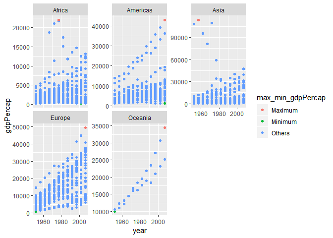
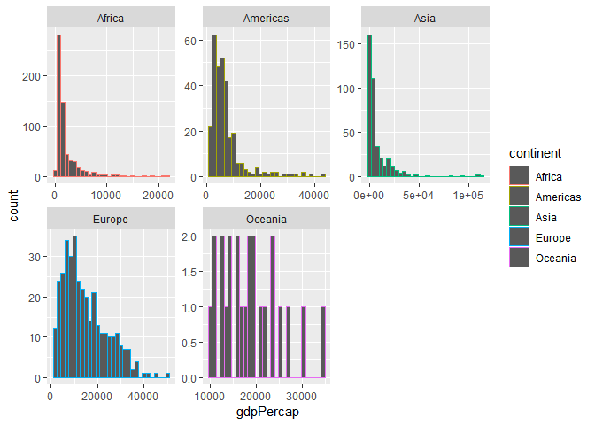
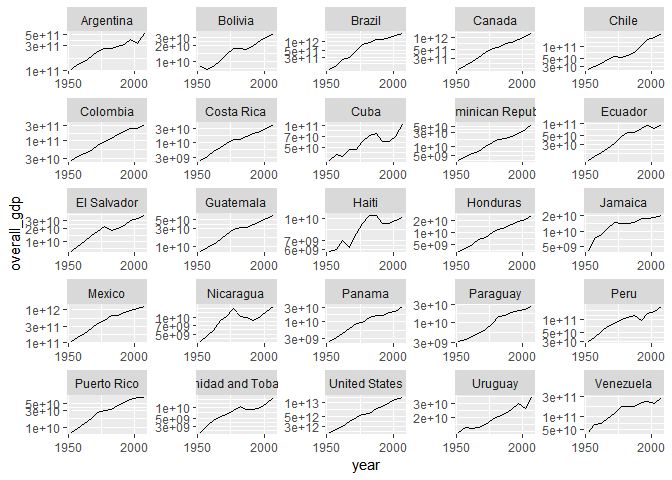

# Bring rectangular data in

```r
## load gapminder
suppressPackageStartupMessages(library(gapminder))
## load tidyverse
suppressPackageStartupMessages(library(tidyverse))
```

# Tasks

## Task #1

**Get the maximum and minimum of GDP per capita for all continents.**

We first create a table to show the maximum and minimum of GDP per capita for all continents.


```r
# get data of maximum and minimum of GDP per capita for all continents
data <- gapminder %>% 
  # group by continent
  group_by(continent) %>% 
  # calculate summaries
  summarize(
    max_gdpPercap = max(gdpPercap),
    min_gdpPercap = min(gdpPercap),
  )
# get corresponding rows for the maximum data
max_country <- gapminder %>% 
  # filter data with maximum GDP per capita
  filter(gdpPercap %in% data$max_gdpPercap) %>% 
  # create column with country and year
  mutate(
    max_country_year = paste(country, year, sep=",")
  ) %>% 
  # make sure the order is the same as "data"
  arrange(continent) %>% 
  # select only mutated column
  select(max_country_year)

# get corresponding rows for the minimum data
min_country <- gapminder %>% 
  # filter data with minimum GDP per capita
  filter(gdpPercap %in% data$min_gdpPercap) %>% 
  # create column with country and year
  mutate(
    min_country_year = paste(country, year, sep=",")
  ) %>% 
  # make sure the order is the same as "data"
  arrange(continent) %>% 
  # select only mutated column
  select(min_country_year)

# display table with combined data
data.frame(
  continent = data$continent,
  max_gdpPercap = data$max_gdpPercap,
  max_country,
  min_gdpPercap = data$min_gdpPercap,
  min_country
) %>% 
  knitr::kable()
```


continent    max_gdpPercap  max_country_year      min_gdpPercap  min_country_year            
----------  --------------  -------------------  --------------  ----------------------------
Africa            21951.21  Libya,1977                 241.1659  Congo, Dem. Rep.,2002       
Americas          42951.65  United States,2007        1201.6372  Haiti,2007                  
Asia             113523.13  Kuwait,1957                331.0000  Myanmar,1952                
Europe            49357.19  Norway,2007                973.5332  Bosnia and Herzegovina,1952 
Oceania           34435.37  Australia,2007           10039.5956  Australia,1952              

Let's show them on a scatterplot.


```r
gapminder %>%
  # create a new column to indicate whether a data point is maximum or minimum gdpPercap
  mutate(
    max_min_gdpPercap = ifelse(
      gdpPercap %in% data$max_gdpPercap,
      "Maximum",
      ifelse(
        gdpPercap %in% data$min_gdpPercap,
        "Minimum",
        "Others"
        )
      )
  ) %>% 
  # year as x axis and gdpPercap as y axis, use max_min_gdpPercap as color
  ggplot(aes(year, gdpPercap, color = max_min_gdpPercap), alpha = 0.1) +
  # make it a scatterplot
  geom_point() +
  # facetting using continent
  facet_wrap(~continent, scales = "free_y") +
  # make a better x axis
  scale_x_continuous(breaks = scales::pretty_breaks(n = 3))
```

<!-- -->

From the table and figure, we notice the maximum and minimum values of gdpPercap are different in different continents. They also appear in different countries and years. The scatterplot provides a better view, except we cannot get which countries has the maximum/minimum gdpPercap.

## Task #2

**Look at the spread of GDP per capita within the continents.**

Let's show a table with the range, mean and deviation of GDP per capita within the continents.


```r
gapminder %>%
  # group by continent
  group_by(continent) %>%
  # calculate summaries
  summarize(
    # calculate minimum
    min_gdpPercap = min(gdpPercap),
    # calculate maximum
    max_gdpPercap = min(gdpPercap),
    # calculate mean
    mean_gdpPercap = mean(gdpPercap),
    # calculate standard deviation
    sd_gdpPercap = sd(gdpPercap)
  ) %>% 
  # display the table
  knitr::kable()
```


continent    min_gdpPercap   max_gdpPercap   mean_gdpPercap   sd_gdpPercap
----------  --------------  --------------  ---------------  -------------
Africa            241.1659        241.1659         2193.755       2827.930
Americas         1201.6372       1201.6372         7136.110       6396.764
Asia              331.0000        331.0000         7902.150      14045.373
Europe            973.5332        973.5332        14469.476       9355.213
Oceania         10039.5956      10039.5956        18621.609       6358.983


We can use histogram and boxplot to do the same task. Notice that in histogram, `scales="free"` is needed to scale both x and y axes, so the figure should be clearer. 


```r
gapminder %>% 
  # gdpPercap as x axis
  ggplot(aes(gdpPercap, color = continent)) +
  # facetting by continent
  facet_wrap(~continent, scales = "free") +
  # make it a histogram
  geom_histogram(bins = 30)  +
  # make a better x axis
  scale_x_continuous(breaks = scales::pretty_breaks(n = 3))
```

<!-- -->


```r
gapminder %>% 
  # continent as x axis, gdpPercap as y axis
  ggplot(aes(continent, gdpPercap)) +
  # scale y axis by log10
  scale_y_log10() +
  # make it a boxplot
  geom_boxplot()
```

<!-- -->

A table provides accurate numbers on the spread of GDP per capita, but it cannot show the details inside the data. While histogram and boxplot provide better summaries (e.g. the boxplot contains outliers). Comparing histogram and boxplot, histogram only counts data within the same bins, while boxplot also shows some statistics facts (like quartiles) of data.

## Task #3

**Compute a trimmed mean of life expectancy for different years. Or a weighted mean, weighting by population. Just try something other than the plain vanilla mean.**

Let's calculate the weighted mean of life expectancy, weighting by population.


```r
means <- gapminder %>% 
  # group by year
  group_by(year) %>% 
  # calculate vanilla mean and weighted mean
  summarize(
    vanilla_mean_lifeExp = mean(lifeExp),
    weighted_mean_lifeExp_by_pop = weighted.mean(lifeExp, pop)
  )

# display as table
means %>% 
  knitr::kable()
```


 year   vanilla_mean_lifeExp   weighted_mean_lifeExp_by_pop
-----  ---------------------  -----------------------------
 1952               49.05762                       48.94424
 1957               51.50740                       52.12189
 1962               53.60925                       52.32438
 1967               55.67829                       56.98431
 1972               57.64739                       59.51478
 1977               59.57016                       61.23726
 1982               61.53320                       62.88176
 1987               63.21261                       64.41635
 1992               64.16034                       65.64590
 1997               65.01468                       66.84934
 2002               65.69492                       67.83904
 2007               67.00742                       68.91909

Let's draw some line plots to show them.


```r
means %>% 
  ggplot() +
  # make a line plot with points for vanilla_mean_lifeExp
  geom_line(aes(year, vanilla_mean_lifeExp, color = "vanilla_mean_lifeExp")) +
  geom_point(aes(year, vanilla_mean_lifeExp, color = "vanilla_mean_lifeExp")) +
  # make a line plot with points for weighted_mean_lifeExp_by_pop
  geom_line(aes(year, weighted_mean_lifeExp_by_pop, color = "weighted_mean_lifeExp_by_pop")) +
  geom_point(aes(year, weighted_mean_lifeExp_by_pop, color = "weighted_mean_lifeExp_by_pop")) +
  # add legend for two lines
  scale_color_discrete("Mean type")
```

<!-- -->

Basically, the life expectancy tends to increase thoughout the years.

## Task #4

**How is life expectancy changing over time on different continents?**

Let's first use a table to show the trend of how life expectancy changes. We also calculate the changes in every five years.


```r
changes <- gapminder %>% 
  # need to group by continent and year
  group_by(continent, year) %>% 
  # use mean as benchmark
  summarize(
    mean_lifeExp = mean(lifeExp)
  ) %>% 
  # calculate absolute change and relative change
  mutate(
    change_in_five_years = mean_lifeExp - lag(mean_lifeExp),
    accumulate_change = mean_lifeExp- first(mean_lifeExp)
  )

# display the table
changes %>% 
  knitr::kable()
```


continent    year   mean_lifeExp   change_in_five_years   accumulate_change
----------  -----  -------------  ---------------------  ------------------
Africa       1952       39.13550                     NA            0.000000
Africa       1957       41.26635              2.1308462            2.130846
Africa       1962       43.31944              2.0530962            4.183942
Africa       1967       45.33454              2.0150962            6.199039
Africa       1972       47.45094              2.1164038            8.315442
Africa       1977       49.58042              2.1294808           10.444923
Africa       1982       51.59287              2.0124423           12.457365
Africa       1987       53.34479              1.7519231           14.209288
Africa       1992       53.62958              0.2847885           14.494077
Africa       1997       53.59827             -0.0313077           14.462769
Africa       2002       53.32523             -0.2730385           14.189731
Africa       2007       54.80604              1.4808077           15.670538
Americas     1952       53.27984                     NA            0.000000
Americas     1957       55.96028              2.6804400            2.680440
Americas     1962       58.39876              2.4384800            5.118920
Americas     1967       60.41092              2.0121600            7.131080
Americas     1972       62.39492              1.9840000            9.115080
Americas     1977       64.39156              1.9966400           11.111720
Americas     1982       66.22884              1.8372800           12.949000
Americas     1987       68.09072              1.8618800           14.810880
Americas     1992       69.56836              1.4776400           16.288520
Americas     1997       71.15048              1.5821200           17.870640
Americas     2002       72.42204              1.2715600           19.142200
Americas     2007       73.60812              1.1860800           20.328280
Asia         1952       46.31439                     NA            0.000000
Asia         1957       49.31854              3.0041503            3.004150
Asia         1962       51.56322              2.2446788            5.248829
Asia         1967       54.66364              3.1004170            8.349246
Asia         1972       57.31927              2.6556291           11.004875
Asia         1977       59.61056              2.2912873           13.296162
Asia         1982       62.61794              3.0073830           16.303545
Asia         1987       64.85118              2.2332424           18.536788
Asia         1992       66.53721              1.6860303           20.222818
Asia         1997       68.02052              1.4833030           21.706121
Asia         2002       69.23388              1.2133636           22.919485
Asia         2007       70.72848              1.4946061           24.414091
Europe       1952       64.40850                     NA            0.000000
Europe       1957       66.70307              2.2945667            2.294567
Europe       1962       68.53923              1.8361667            4.130733
Europe       1967       69.73760              1.1983667            5.329100
Europe       1972       70.77503              1.0374333            6.366533
Europe       1977       71.93777              1.1627333            7.529267
Europe       1982       72.80640              0.8686333            8.397900
Europe       1987       73.64217              0.8357667            9.233667
Europe       1992       74.44010              0.7979333           10.031600
Europe       1997       75.50517              1.0650667           11.096667
Europe       2002       76.70060              1.1954333           12.292100
Europe       2007       77.64860              0.9480000           13.240100
Oceania      1952       69.25500                     NA            0.000000
Oceania      1957       70.29500              1.0400000            1.040000
Oceania      1962       71.08500              0.7900000            1.830000
Oceania      1967       71.31000              0.2250000            2.055000
Oceania      1972       71.91000              0.6000000            2.655000
Oceania      1977       72.85500              0.9450000            3.600000
Oceania      1982       74.29000              1.4350000            5.035000
Oceania      1987       75.32000              1.0300000            6.065000
Oceania      1992       76.94500              1.6250000            7.690000
Oceania      1997       78.19000              1.2450000            8.935000
Oceania      2002       79.74000              1.5500000           10.485000
Oceania      2007       80.71950              0.9795000           11.464500

Let's plot it out.


```r
changes %>% 
  # year as x axis and mean_lifeExp as y axis
  ggplot(aes(year, mean_lifeExp)) +
  # facetting by continent
  facet_wrap(~continent, scales="free_y")+
  # make a line plot with points
  geom_line() +
  geom_point()
```

<!-- -->


```r
changes %>%
  # remove NA values
  filter(!is.na(change_in_five_years)) %>% 
  # year as x axis and change_in_five_years as y axis
  ggplot(aes(year, change_in_five_years)) +
  # facetting by continent
  facet_wrap(~continent, scales = "free_y")+
  # make a line plot with points
  geom_line() +
  geom_point()
```

<!-- -->


```r
changes %>%
  # year as x axis and accumulate_change as y axis
  ggplot(aes(year, accumulate_change)) +
  # facetting by continent
  facet_wrap(~continent, scales = "free_y")+
  # make a line plot with points
  geom_line() +
  geom_point()
```

<!-- -->

From the above two figures, we get to know:

- Except Africa suffered from a decrement between 1997 and 2002, all the continents have increment throughout the years.
- Generally speaking, except Oceania, the speeds of lifeExp grows of other continents become smaller and smaller.

## Task #5 

**Report the absolute and/or relative abundance of countries with low life expectancy over time by continent: Compute some measure of worldwide life expectancy - you decide - a mean or median or some other quantile or perhaps your current age. Then determine how many countries on each continent have a life expectancy less than this benchmark, for each year.**

Let's first know the range and mean of worldwide life expectancy, so we can decide a benchmark.


```r
range(gapminder$lifeExp)
```

```
## [1] 23.599 82.603
```


```r
mean(gapminder$lifeExp)
```

```
## [1] 59.47444
```

The mean is somehow near the middle of the range, so we can use it as a benchmark.

Let's first check if the lifeExp of a country in a certain year is higher/lower than the average.


```r
lifeExpCheck <- gapminder %>% 
  # group by country and year
  group_by(country, year) %>% 
  # check if a country has low lifeExp
  mutate(
    low_lifeExp = lifeExp < mean(gapminder$lifeExp)
  ) %>% 
  # select only necessary columns
  select(country, year, lifeExp, low_lifeExp)

# show previews
head(lifeExpCheck) %>% 
  knitr::kable()
```


country        year   lifeExp  low_lifeExp 
------------  -----  --------  ------------
Afghanistan    1952    28.801  TRUE        
Afghanistan    1957    30.332  TRUE        
Afghanistan    1962    31.997  TRUE        
Afghanistan    1967    34.020  TRUE        
Afghanistan    1972    36.088  TRUE        
Afghanistan    1977    38.438  TRUE        

```r
tail(lifeExpCheck) %>% 
  knitr::kable()
```


country     year   lifeExp  low_lifeExp 
---------  -----  --------  ------------
Zimbabwe    1982    60.363  FALSE       
Zimbabwe    1987    62.351  FALSE       
Zimbabwe    1992    60.377  FALSE       
Zimbabwe    1997    46.809  TRUE        
Zimbabwe    2002    39.989  TRUE        
Zimbabwe    2007    43.487  TRUE        

To show the abundance of countries with low lifeExp, we can simply count the number of TRUE/FALSE in low_lifeExp. A bar plot is suitable in this case.


```r
lifeExpCheck %>% 
  # year as x axis, and show the portion of low_lifeExp
  ggplot(aes(year, fill = low_lifeExp)) +
  # make it a bar plot
  geom_bar()
```

<!-- -->

From the figure, we know that the numbers of countries with low lifeExp become smaller and smller over the years.

## Task #6

**Find countries with interesting stories. Open-ended and, therefore, hard. Promising but unsuccessful attempts are encouraged. This will generate interesting questions to follow up on in class.**

Let's try to list data in countries in Americas first, and see if we can find something intersting.


```r
countries <- gapminder %>% 
  # filter continent as Americas
  filter(continent == "Americas") %>%
  # remove column continent
  select(-continent) %>% 
  # group by country and year
  group_by(country, year)

# show previews
head(countries) %>% 
  knitr::kable()
```


country      year   lifeExp        pop   gdpPercap
----------  -----  --------  ---------  ----------
Argentina    1952    62.485   17876956    5911.315
Argentina    1957    64.399   19610538    6856.856
Argentina    1962    65.142   21283783    7133.166
Argentina    1967    65.634   22934225    8052.953
Argentina    1972    67.065   24779799    9443.039
Argentina    1977    68.481   26983828   10079.027

```r
tail(countries) %>% 
  knitr::kable()
```


country      year   lifeExp        pop   gdpPercap
----------  -----  --------  ---------  ----------
Venezuela    1982    68.557   15620766   11152.410
Venezuela    1987    70.190   17910182    9883.585
Venezuela    1992    71.150   20265563   10733.926
Venezuela    1997    72.146   22374398   10165.495
Venezuela    2002    72.766   24287670    8605.048
Venezuela    2007    73.747   26084662   11415.806

We try to explore the following things.

### Is there a relationship between lifeExp and pop?


```r
countries %>% 
  # pop as x axis and lifeExp as y axis
  ggplot(aes(pop, lifeExp)) +
  # scale y axis by log10
  scale_y_log10() +
  # facetting by country
  facet_wrap(~country, scales = "free") +
  # make a line plot
  geom_line() +
  # make a better x axis
  scale_x_continuous(breaks=NULL)
```

<!-- -->

Interestingly, when the population gets larger, the life expectancy also becomes larger!

### What is the overall GDP of each country and how do they change over the years?


```r
countries_with_overall_gdp <- countries %>% 
  # calculate overall GDP
  mutate(
    overall_gdp = pop * gdpPercap
  )

countries_with_overall_gdp %>% 
  # year as x axis and overall_gdp as y axis
  ggplot(aes(year, overall_gdp)) +
  # facetting by country
  facet_wrap(~country, scales = "free") +
  # make a line plot
  geom_line() +
  # scale y axis by log10
  scale_y_log10() +
  # make a better x axis
  scale_x_continuous(breaks = scales::pretty_breaks(n = 2))
```

<!-- -->

So we can notice some flactuations in these resultant lines. But it is a trend that every country has an increasing overall GDP.

### Does overall GDP affect life expectancy?


```r
countries_with_overall_gdp %>% 
  # overall_gdp as x axis and lifeExp as y axis
  ggplot(aes(overall_gdp, lifeExp)) +
  # facetting by country
  facet_wrap(~country, scales = "free") +
  # scale y axis by log10
  scale_y_log10() +
  # make it a line plot
  geom_line() +
  # make a better x axis
  scale_x_continuous(breaks = NULL)
```

<!-- -->

Though we notice some flactuations in these lines, we somehow can conclude that when the overall GDP of a country is high, the lifeExp is also high.

# But I want to do more!

## Layout stretch goal: get table and figure side-by-side.

We directly use code form the third task, but put the table and figure side-by-side.

<style type="text/css">
.twoC {width: 100%}
.clearer {clear: both}
.twoC .table {max-width: 50%; float: left}
.twoC img {max-width: 50%; float: right}
</style>

<div class="twoC">


 year   vanilla_mean   weighted_mean
-----  -------------  --------------
 1952       49.05762        48.94424
 1957       51.50740        52.12189
 1962       53.60925        52.32438
 1967       55.67829        56.98431
 1972       57.64739        59.51478
 1977       59.57016        61.23726
 1982       61.53320        62.88176
 1987       63.21261        64.41635
 1992       64.16034        65.64590
 1997       65.01468        66.84934
 2002       65.69492        67.83904
 2007       67.00742        68.91909

<!-- -->
</div>

<div class="clearer"></div>

## Table stretch goal: there are some really nice fancy table helper packages.

We show one example (not very fancy) using pander and xtable respectively, assuming these two packages have been already installed.


```r
suppressPackageStartupMessages(library(pander))
suppressPackageStartupMessages(library(xtable))
```


### pander


```r
emphasize.strong.cols(1)
emphasize.italics.cells(which(means >= 60, arr.ind = TRUE))
pander(means)
```


----------------------------------------------------------------
   year     vanilla_mean_lifeExp   weighted_mean_lifeExp_by_pop 
---------- ---------------------- ------------------------------
 **1952**          49.06                      48.94             

 **1957**          51.51                      52.12             

 **1962**          53.61                      52.32             

 **1967**          55.68                      56.98             

 **1972**          57.65                      59.51             

 **1977**          59.57                     *61.24*            

 **1982**         *61.53*                    *62.88*            

 **1987**         *63.21*                    *64.42*            

 **1992**         *64.16*                    *65.65*            

 **1997**         *65.01*                    *66.85*            

 **2002**         *65.69*                    *67.84*            

 **2007**         *67.01*                    *68.92*            
----------------------------------------------------------------


### xtable


```r
print(xtable(means), type = "html")
```

<!-- html table generated in R 3.5.1 by xtable 1.8-3 package -->
<!-- Tue Oct 02 10:30:05 2018 -->
<table border=1>
<tr> <th>  </th> <th> year </th> <th> vanilla_mean_lifeExp </th> <th> weighted_mean_lifeExp_by_pop </th>  </tr>
  <tr> <td align="right"> 1 </td> <td align="right"> 1952 </td> <td align="right"> 49.06 </td> <td align="right"> 48.94 </td> </tr>
  <tr> <td align="right"> 2 </td> <td align="right"> 1957 </td> <td align="right"> 51.51 </td> <td align="right"> 52.12 </td> </tr>
  <tr> <td align="right"> 3 </td> <td align="right"> 1962 </td> <td align="right"> 53.61 </td> <td align="right"> 52.32 </td> </tr>
  <tr> <td align="right"> 4 </td> <td align="right"> 1967 </td> <td align="right"> 55.68 </td> <td align="right"> 56.98 </td> </tr>
  <tr> <td align="right"> 5 </td> <td align="right"> 1972 </td> <td align="right"> 57.65 </td> <td align="right"> 59.51 </td> </tr>
  <tr> <td align="right"> 6 </td> <td align="right"> 1977 </td> <td align="right"> 59.57 </td> <td align="right"> 61.24 </td> </tr>
  <tr> <td align="right"> 7 </td> <td align="right"> 1982 </td> <td align="right"> 61.53 </td> <td align="right"> 62.88 </td> </tr>
  <tr> <td align="right"> 8 </td> <td align="right"> 1987 </td> <td align="right"> 63.21 </td> <td align="right"> 64.42 </td> </tr>
  <tr> <td align="right"> 9 </td> <td align="right"> 1992 </td> <td align="right"> 64.16 </td> <td align="right"> 65.65 </td> </tr>
  <tr> <td align="right"> 10 </td> <td align="right"> 1997 </td> <td align="right"> 65.01 </td> <td align="right"> 66.85 </td> </tr>
  <tr> <td align="right"> 11 </td> <td align="right"> 2002 </td> <td align="right"> 65.69 </td> <td align="right"> 67.84 </td> </tr>
  <tr> <td align="right"> 12 </td> <td align="right"> 2007 </td> <td align="right"> 67.01 </td> <td align="right"> 68.92 </td> </tr>
   </table>

# Notes
- Currently I do not know how to make better labels of x axis in facetting figures. Now I can only  suppress all of them for some figures in section "Task #6".
- I do not like the way to show a table and a figure side-by-side. The reason is, it can be only used in HTML, but on GitHub it does not support direct viewing of HTML.

# References
- [pander: An R Pandoc Writer](http://rapporter.github.io/pander/)
- [The xtable Gallery](https://cran.r-project.org/web/packages/xtable/vignettes/xtableGallery.pdf)
